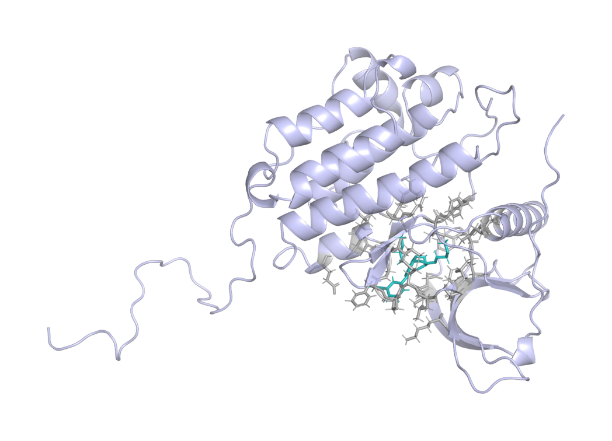
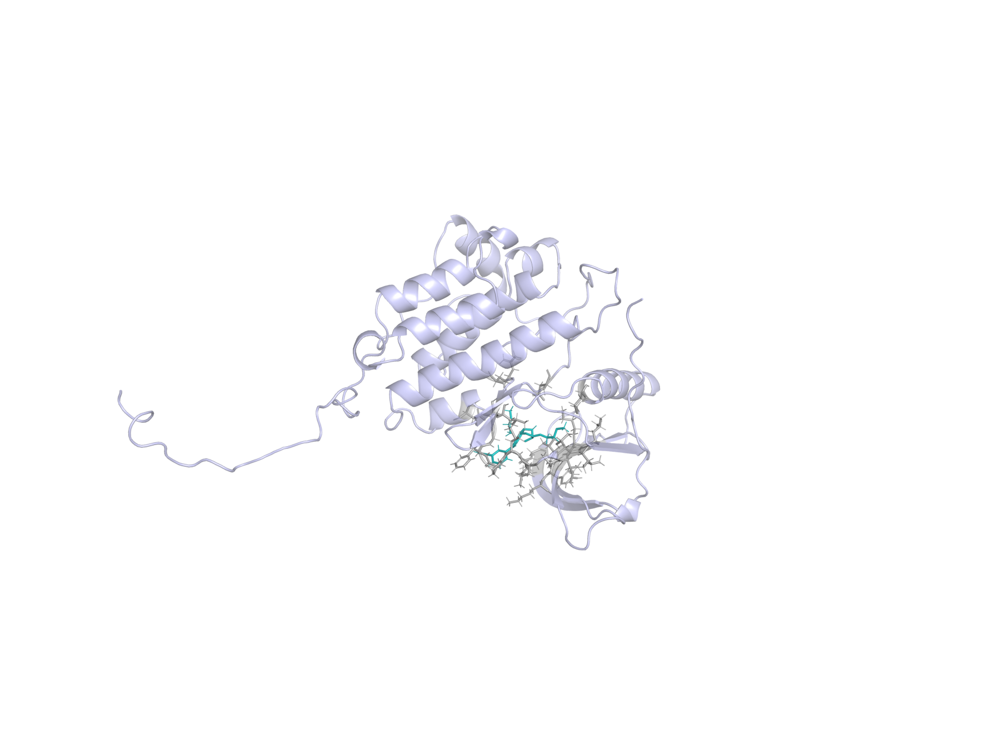

# Abstract

**Background.** Docking and neural rescoring can rank ligands without establishing whether the selected receptor-specific pose recovers interactions observed in target holo structures. We asked whether a target-native interaction prior adds incremental early-enrichment information to GNINA when both signals are evaluated on the same pose.

**Methods.** The workflow combined four-state EGFR ensemble docking, GNINA CNNscore, and ProLIF interaction fingerprints. A native-derived ATP-site union prior was constructed from the same four EGFR holo complexes. The primary ligand score was the maximum, across those receptor states, of CNNscore multiplied by one plus same-pose interaction recall. The scoring rule was developed and fixed on EGFR and subsequently applied unchanged to CDK2 as a target-transfer evaluation. We used paired class-stratified bootstraps, a pose-decoupled late-fusion comparator, three permutation controls, receptor and native-complex exclusions, exact native-ligand-overlap audits, and similarity and size analyses. The original five-receptor ensemble including 6DUK was retained only as a sensitivity analysis.

**Results.** Pose-coupled weighting increased four-receptor EGFR EF1% from 11.98 to 16.40, recovering 89 rather than 65 actives among the first 356 ranked molecules. The paired EF1% difference was 4.42 (95% CI 2.58 to 6.63). A pose-decoupled late-fusion comparator reached EF1% 15.85, and its difference from pose-coupled scoring was unresolved. The effect exceeded unrestricted, heavy-atom-count-matched, and class-conditional assignment nulls; it persisted after every primary-receptor exclusion, removal of the exact-overlap native ligand, and joint removal of duplicate AQ4 complexes. Adding 6DUK only in a five-receptor sensitivity analysis did not materially change the conclusion. The chemically coherent four-receptor CDK2 analysis showed a favorable but conservative EF1% difference of 2.74 (95% CI 0.00 to 5.06).

**Conclusions.** Native-interaction information improved early enrichment in the evaluated retrospective EGFR benchmark, while same-pose coupling retained an auditable receptor-specific structural basis for the combined score. The unresolved CDK2 result indicates that its contribution must be established separately for each target and receptor ensemble.

**Scientific Contribution.** We introduce and evaluate a pose-coupled native-interaction weighting rule that exposes the structural evidence behind a neural docking score. Paired, permutation, and exclusion controls show that the EGFR early-enrichment signal depends on observed ligand-specific interaction profiles and is not attributable solely to molecular size, activity-class distributions, any single receptor state, or exact native-ligand overlap.

**Keywords:** structure-based virtual screening; docking; interaction fingerprints; early enrichment; EGFR; CDK2

# Background

Structure-based virtual screening is a ranking problem conditioned on pose generation. A docking program may sample a near-native geometry without ranking it first, and a favorable score alone does not establish that the selected pose is structurally credible [@trott2010; @amaro2018; @buttenschoen2024]. Neural scoring functions such as GNINA improve pose assessment by learning protein-ligand patterns from three-dimensional data, but their outputs remain statistical scores rather than explicit tests of whether a pose retains contacts characteristic of a target [@mcnutt2021; @mcnutt2025].

Protein-ligand interaction fingerprints provide that explicit representation. SIFt, SPLIF, kinase interaction profiles, and tools such as ProLIF encode complexes as residue-by-interaction descriptors and have been used for pose comparison, binding-mode analysis, and rescoring [@deng2004; @chuaqui2005; @marcou2007; @da2014; @bouysset2021]. Prior fingerprint-based methods commonly compare a docked pose with a reference pattern after docking. The unresolved methodological issue is how to combine this reference evidence with a learned score across a receptor ensemble.

That combination must preserve pose identity. If the highest neural score is taken from one receptor state and the highest interaction value from another, their combination can reward two incompatible poses. The resulting late-fusion score has no corresponding physical protein-ligand geometry. We instead evaluate both terms for the same ligand, receptor state, and docked pose before maximizing over receptor states.

Syndesis was designed around one narrow hypothesis: a native-derived interaction prior can add early-enrichment information to GNINA when both terms are evaluated for the same receptor-specific pose. EGFR served as the method-development and primary retrospective-evaluation target, whereas CDK2 was used as a target-transfer evaluation after the scoring rule and primary analysis choices had been fixed. The primary endpoint was retrospective ranking rather than activity prediction.

# Methods

## Study design and structural inputs

The primary study was a paired comparison between GNINA and a pose-coupled GNINA-plus-interaction score on the same EGFR ligand-receptor evaluations. The primary EGFR docking ensemble comprised 1M17, 1XKK, 4HJO, and 5CAV. These four ATP-site holo structures also defined the native-derived interaction prior (1M17/AQ4, 1XKK/FMM, 4HJO/AQ4, and 5CAV/4ZQ). The allosteric-ligand-stabilized 6DUK conformation was excluded from the primary analysis because it lacks a matched ATP-site holo ligand for defining a receptor-specific interaction reference. A separate five-state sensitivity added ligand-stripped 6DUK while retaining the four-complex ATP-site prior [@to2019]. CDK2 used 1QMZ/ATP, 1FIN/ATP, 2A4L/RRC, 1AQ1/STU, and 1PXN/CK6; its primary transfer analysis excluded 1QMZ because extraction removed deposited phosphothreonine TPO160. Receptor identities, chains, docking boxes, quality decisions, and residue maps are machine-readable in the release.

EGFR receptor chains were prepared from PDB structures [@berman2000], with non-protein residues removed and Open Babel 3.1.0 used to produce pH 7.4, Gasteiger-charged PDBQT receptors. For docked-pose fingerprints, the ProLIF protein was regenerated from the exact docking PDBQT by Open Babel; ProLIF then assigned residue, aromatic, donor, and acceptor chemical perception to that docking-derived model. The four primary receptors had identical docking and ProLIF heavy-atom sets and zero ProLIF-only atoms. The CDK2 chain-A extractor represented 1QMZ without HETATM phosphothreonine TPO160; the 1QMZ-excluded result is therefore treated as a sensitivity analysis rather than a phosphorylated-CDK2 model.

**Table 1.** Receptor ensembles, benchmark sizes, and native-prior complexes.

| Target | Docking receptor states | Benchmark molecules | Native-prior complexes |
|---|---|---:|---:|
| EGFR | 1M17, 1XKK, 4HJO, 5CAV | 35,552 (542 actives; 35,010 decoys) | 4 ATP-site complexes |
| CDK2 | 1FIN, 2A4L, 1AQ1, 1PXN | 28,296 (474 actives; 27,822 decoys) | 5 native complexes (primary receptor set excludes 1QMZ) |

## Docking, interaction encoding, and score coupling

DUD-E input SMILES were converted to one ETKDGv3 three-dimensional state per record (RDKit random seed `0xF00D`), optimized with MMFF94 for at most 1,000 iterations, and converted to PDBQT with Open Babel [@mysinger2012; @landrum2013; @halgren1996; @oboyle2011]. Embedding failures were recorded as preparation failures; an MMFF exception retained the ETKDG conformer and was recorded in the preparation status. Alternative protomers, tautomers, stereoisomers, and conformers were not enumerated. Each ligand was docked independently to 1M17, 1XKK, 4HJO, and 5CAV with Uni-Dock 1.2.0 in `balance` mode, nine output modes, and seed 807 [@yu2023unidock]. Only the top Uni-Dock pose per ligand-receptor pair entered the enrichment analysis. GNINA 1.3.3 used its default `rescore` CNN model in `--score_only` mode, with pose minimization disabled; the parsed `CNNscore` field was the neural ranking term [@mcnutt2021; @mcnutt2025].

ProLIF 2.2.0 encoded hydrophobic, implicit donor and acceptor, ionic, cation-pi, pi-cation, and van der Waals interactions as normalized residue-by-interaction-type bits [@bouysset2021]. Configured distance cutoffs were 3.6 Å for hydrogen bonds, 4.5 Å for hydrophobic and ionic contacts, and 4.0 Å for van der Waals contacts; ProLIF default geometry policies otherwise applied. Docked coordinates were transferred onto the prepared SDF graph before fingerprinting, preserving bond order, formal charge, tautomerism, and stereochemistry. Atom-order, element, count, and coordinate-mapping failures were not converted to zero scores; all 142,208 primary EGFR ligand-receptor evaluations passed this reconstruction audit.

Let $F_{i,r}$ be the fingerprint for ligand $i$ in receptor state $r$, and $N_k$ the fingerprint for native complex $k$. The primary prior was the target-native union $C=\bigcup_k N_k$, with 62 EGFR and 47 CDK2 bits. Same-pose recall was $R_{i,r}=|F_{i,r}\cap C|/|C|$. The coupled ligand score was

$$
S_i=\max_r\{\mathrm{CNNscore}_{i,r}[1+R_{i,r}]\}.
$$

The matched GNINA baseline was $G_i=\max_r\{\mathrm{CNNscore}_{i,r}\}$ over the same four receptor-specific top Uni-Dock poses. The pose-decoupled comparator was $L_i=[\max_r\{\mathrm{CNNscore}_{i,r}\}][1+\max_r\{R_{i,r}\}]$; it can combine values from different receptor states and is therefore not assigned to a single physical pose.

The multiplier is bounded between one and two. Critically, CNNscore and recall in each product belong to the same pose. As summarized in @fig-pose-coupling-workflow, the workflow preserves this same-pose relationship. EGFR labels informed method development, so EGFR is reported as the method-development and primary retrospective-evaluation target. The scoring rule (multiplicative union recall with $\lambda=1$), EF1% endpoint, bootstrap design, and seeds were fixed before final strict fingerprint recomputation and were then applied unchanged to CDK2 for target-transfer evaluation. Alternative priors and formulas were sensitivity analyses, not selection criteria.

{#fig-pose-coupling-workflow width=72% fig-alt="Vertical workflow from four native EGFR complexes to same-pose coupled ligand ranking across four receptor states."}

## Statistical evaluation

EF1% was the primary endpoint; ROC-AUC, EF5%, and BEDROC ($\alpha=80.5$) were secondary [@truchon2007]. The top 1% set used $\max[1,\operatorname{round}(0.01N)]$ molecules, with stable input order resolving score ties. We used 2,000 paired class-stratified bootstrap resamples (seed 807). Three 1,000-draw permutation controls reassigned complete receptor-ensemble recall vectors: across all ligands, within heavy-atom-count deciles, and within activity class. The last preserves active-decoy recall distributions and tests molecule-specific assignment rather than a general random-score null. Empirical permutation values were $p=(b+1)/(1000+1)$, where $b$ was the number of null draws at least as large as the observed EF1%. Receptor exclusions, native-complex exclusions, joint duplicate-chemotype exclusions, exact native/DUD-E identity checks, ECFP4 similarity strata, and recall-size correlations tested robustness [@bemis1996; @rogers2010]. The five-receptor 6DUK-inclusive result was evaluated separately as an ensemble sensitivity, and receptor-specific-prior sensitivity was restricted to the four primary EGFR receptors. DUD-E decoys are property-matched benchmark compounds rather than experimentally confirmed inactives, and its analogue and decoy construction can introduce benchmark-specific bias; this analysis therefore evaluates incremental ranking performance, not prospective activity prediction [@mysinger2012; @stein2021; @wallach2018].

## Redocking evaluation

The redocking benchmark contained 15 receptor-ligand tasks spanning 13 ligand chemotypes and 11 Bemis-Murcko scaffolds. Uni-Dock generated nine poses per task under the same `balance` mode and seed policy as the benchmark; symmetry-corrected heavy-atom RMSD to the deposited ligand defined native-like poses at no more than 2.0 Å. Twelve tasks sampled at least one native-like pose and entered the ranking comparison. We compared top-ranked docking score and GNINA CNNscore by NDCG@1, using 2,000 task-level bootstrap resamples for percentile 95% intervals.

## Molecular-dynamics stress test

Molecular dynamics (MD) was a downstream pose-persistence stress test, not an activity or binding-free-energy calculation. Seven preselected EGFR complexes were simulated: three known-ligand controls, three deterministic RDKit-generated analogs, and one deliberately mis-docked negative control. Ligands retained their prepared molecular state and were parameterized with AmberTools 24.8 using GAFF2 and AM1-BCC charges, then exported through ACPYPE 2023.10.27 [@case2023; @wang2004; @daSilva2012]. Each complex used Amber ff19SB protein parameters, OPC3 water, 0.15 M NaCl, a dodecahedral box with 1.0 nm padding, and GROMACS 2026.0 [@tian2020; @abraham2015].

Each system underwent energy minimization (up to 50,000 steps), 0.5 ns NVT and 1.0 ns NPT equilibration at 300 K and 1 bar, followed by three independent 20 ns NPT production trajectories with a 2 fs timestep. Trajectories were reconstructed across periodic boundaries and aligned per frame to the initial backbone atoms of pocket residues within 6 Å of the reference ligand. Ligand heavy-atom RMSD was then measured in that local protein frame. A ligand frame was retained in the pocket when any ligand heavy atom lay within 4.5 Å of a pocket heavy atom. Key-interaction occupancies used minimum heavy-atom distances of 3.5 Å for hydrogen-bond interactions, 4.0 Å for ionic interactions, and 4.5 Å otherwise. Binding-mode persistence was the mean key-interaction occupancy; the full per-frame measurements are released.

A replicate was labeled stable only when median ligand RMSD was at most 3.0 Å, its 95th-percentile RMSD was at most 5.0 Å, at least 90% of frames remained in the pocket, hinge occupancy was at least 0.30, and mean key-interaction occupancy was at least 0.50. A system required a strict majority of completed replicates to be stable. Parameterization and trajectory warnings were retained in the released tables; GAFF2/AM1-BCC parameters are an open, practical parameterization workflow rather than a guarantee of exact ligand physics.

# Results

## Redocking confirms that pose generation and pose selection are distinct

Before evaluating ligand enrichment, we performed redocking as a methodological check to determine whether Uni-Dock could generate native-like poses and whether its scoring function selected them. In one AQ4 task, a 0.83 Å pose was sampled while the top-ranked docking pose was 5.81 Å from the reference. Across 12 tasks containing a native-like sampled pose, GNINA CNNscore achieved NDCG@1 of 0.833 (95% CI 0.583 to 1.000), compared with 0.500 (0.250 to 0.750) for docking score. This analysis evaluates pose sampling and ranking only; it does not test the interaction-coupled enrichment rule.

## Pose-coupled weighting improves early EGFR enrichment

Table 2 and @fig-enrichment summarize the primary comparison between GNINA and the pose-coupled score on the four-receptor EGFR ensemble. The benchmark contained 542 actives and 35,010 decoys, and the top 1% of the ranking therefore comprised 356 molecules. GNINA recovered 65 actives in this subset, corresponding to an EF1% of 11.98, whereas the pose-coupled score recovered 89 actives and increased EF1% to 16.40. This represents 24 additional actives and a paired EF1% improvement of 4.42 units (95% CI 2.58–6.63). Improvements were also observed for ROC-AUC, EF5%, and BEDROC, although the largest practical effect occurred at the top of the ranking, consistent with the intended use of the method for early compound prioritization.

**Table 2.** EGFR enrichment across the four-receptor primary ensemble. Intervals are percentile 95% confidence intervals from 2,000 class-stratified bootstrap resamples.

| Ranking arm | ROC-AUC (95% CI) | EF1% (95% CI) | EF5% (95% CI) | BEDROC (95% CI) |
|---|---:|---:|---:|---:|
| GNINA | 0.770 (0.746-0.794) | 11.98 (9.40-14.56) | 7.01 (6.27-7.78) | 0.210 (0.178-0.244) |
| **Pose-coupled score** | **0.775 (0.751-0.798)** | **16.40 (13.63-19.35)** | **7.71 (6.90-8.52)** | **0.282 (0.245-0.320)** |
| Pose-decoupled late fusion* | 0.776 | 15.85 | 7.60 | 0.269 |

*Late-fusion values are point estimates. The prespecified paired EF1% contrast with pose coupling is reported in the text.

{#fig-enrichment width=100% fig-alt="Enrichment metrics for GNINA and pose-coupled scoring on EGFR and CDK2."}

We next tested whether the EF1% increase could be reproduced after disconnecting interaction recall from the ligand to which it belonged. Each ligand’s complete four-receptor recall vector was randomly reassigned 1,000 times under three permutation schemes. The unrestricted permutation exchanged recall vectors among all ligands and produced a mean EF1% of 11.35 ($p=0.0010$). The heavy-atom-count-matched permutation exchanged vectors only among similarly sized ligands and produced a mean EF1% of 12.39 ($p=0.0010$), indicating that the observed gain was not explained by ligand size alone. The class-conditional permutation exchanged vectors separately among actives and among decoys, thereby preserving class-level recall differences while disrupting the association between each ligand and its own interaction profile. This more stringent null produced a mean EF1% of 14.26 ($p=0.0040$). As shown in @fig-permutation, the observed EF1% of 16.40 lay beyond all three permutation distributions, supporting a molecule-specific contribution from the correctly assigned interaction information.

The pose-decoupled late-fusion comparator reported in Table 2 independently combined each ligand’s highest CNNscore and highest recall across receptor states, even when the two values originated from different poses. This comparator achieved an EF1% of 15.85 and recovered 86 actives. The pose-coupled score was numerically higher by 0.55 EF1% units, but the paired 95% interval ranged from −0.37 to 2.21 and therefore included zero. The analysis does not establish superior enrichment over late fusion; rather, it shows that comparable performance can be obtained with a score whose neural and interaction components correspond to one physically defined ligand–receptor pose.

{#fig-permutation width=100% fig-alt="Permutation distributions with observed pose-coupled enrichment marked for EGFR and CDK2."}

## Robustness analyses localize the scope of the EGFR result

No single primary receptor explained the effect: leave-one-receptor-out EF1% gains ranged from 3.50 to 4.79, with all paired intervals excluding zero. Removing the exact-overlap FMM native ligand retained EF1% 15.29 and a paired gain of 3.32 (95% CI 1.84 to 5.34); removing both AQ4 complexes retained EF1% 15.66 and a gain of 3.69 (1.11 to 6.08). Among 369 actives with maximum ECFP4 similarity below 0.30 to every distinct native ligand, the coupled ranking recovered 54 in the global top 1%, compared with 39 for GNINA.

Recall correlated with heavy-atom count ($\rho=0.218$) and molecular weight ($\rho=0.221$), and more strongly with total detected contacts ($\rho=0.704$). This motivates the heavy-atom-count-matched null and prevents interpreting union recall as size-free. The 60%-frequency core, frequency-weighted, Jaccard, and four-receptor-specific priors gave EF1% values of 17.14, 16.58, 15.85, and 16.03, respectively, versus 11.98 for GNINA. These are robustness observations, not evidence that one weighting formula is universally optimal.

Across $\lambda=0.25$ to $3$ in $\mathrm{CNNscore}[1+\lambda R]$, the EGFR direction remained positive (EF1% 13.82 to 18.24); $\lambda=1$ was the development-fixed primary value rather than the empirically optimal value.

## Five-receptor ensemble sensitivity

The original ensemble was re-evaluated separately by adding ligand-stripped 6DUK to the four primary receptor states while retaining the same ATP-site prior. Its GNINA EF1% was 11.79 and its coupled EF1% was 16.40, for a paired difference of 4.61 (95% CI 2.58 to 6.82). Thus, 6DUK changed the GNINA-selected baseline slightly but did not change the coupled top-1% active count (89) or the conclusion that same-pose interaction coupling improves EGFR early enrichment. This sensitivity result is not part of the primary protocol.

{#fig-receptor-sensitivity width=92% fig-alt="Receptor-exclusion effects on coupled-score EF1% differences."}

## CDK2 defines a transfer boundary

CDK2 was used to test transfer of the EGFR-developed scoring rule to a second kinase target. The primary CDK2 ensemble excluded 1QMZ because the extraction workflow removed phosphothreonine TPO160. Across 1FIN, 2A4L, 1AQ1, and 1PXN, coupled scoring increased EF1% from 11.39 to 14.13, corresponding to a paired difference of 2.74 (95% CI 0.00 to 5.06). The five-receptor result including the altered 1QMZ representation is retained as a sensitivity analysis. Native-prior overlap remained unresolved: joint removal of the two ATP complexes gave EF1% 12.45 (paired difference 1.48; 95% CI -1.27 to 3.80), while removal of exact-overlap inhibitor complexes gave EF1% 12.45 (difference 1.48; -0.85 to 4.22). These sensitivity results reinforce that CDK2 transfer should be interpreted conservatively.

**Table 3.** CDK2 four-receptor transfer analysis. Intervals are percentile 95% confidence intervals from 2,000 class-stratified bootstrap resamples.

| Ranking arm | ROC-AUC (95% CI) | EF1% (95% CI) | EF5% (95% CI) | BEDROC (95% CI) |
|---|---:|---:|---:|---:|
| GNINA | 0.749 (0.721-0.776) | 11.39 (9.07-13.92) | 6.88 (6.03-7.68) | 0.229 (0.192-0.264) |
| Pose-coupled score | 0.754 (0.725-0.780) | 14.13 (11.18-16.66) | 7.17 (6.33-8.02) | 0.257 (0.218-0.296) |

## Replicated MD distinguishes persistent and unstable poses

All 21 planned production trajectories completed. The majority-replicate gate labeled two of three known-ligand controls and two of three deterministic analogs as MD-stable; the deliberately mis-docked control was unstable in all three replicates. The latter had a median ligand RMSD of 5.72 Å and median key-interaction occupancy of 0.008, whereas accepted systems had median ligand RMSD of 1.80–2.30 Å and key-interaction occupancy of 0.52–0.69. One known control and one analog were rejected despite low-to-moderate median RMSD because their hinge or aggregate key-interaction occupancy did not meet the predefined gate. These labels assess persistence of the modeled binding mode and do not establish affinity or biological activity.

**Table 4.** Replicated 20 ns MD stress-test outcomes. Values are medians across three independent production trajectories.

| System | Origin | Stable replicates | Ligand RMSD (Å) | Key-interaction occupancy | Decision |
|---|---|---:|---:|---:|---|
| Control 001 | Known ligand | 0/3 | 1.99 | 0.43 | Unstable |
| Control 002 | Known ligand | 3/3 | 1.80 | 0.62 | Stable |
| Control 003 | Known ligand | 3/3 | 2.16 | 0.69 | Stable |
| Analog 004 | Deterministic analog | 2/3 | 1.87 | 0.52 | Stable |
| Analog 005 | Deterministic analog | 0/3 | 3.43 | 0.55 | Unstable |
| Analog 006 | Deterministic analog | 3/3 | 2.30 | 0.64 | Stable |
| Mis-docked control | Deliberate negative control | 0/3 | 5.72 | 0.008 | Unstable |

::: {#fig-md-frames layout-ncol=2 fig-cap="GROMACS production-trajectory coordinates for the MD-stable Control 002 complex, replicate 1. Left: first saved frame (0 ns). Right: final saved frame (20 ns). The end frame was aligned to the start frame on protein atoms; both uncropped panels show the complete EGFR protein, teal ligand, and grey ATP-pocket residues within 5 Å of the ligand. These snapshots illustrate modeled pocket retention and complement the replicate-level metrics in Table 4."}
{fig-alt="Uncropped full-protein GROMACS production-trajectory frame at 0 ns, showing the Control 002 ligand in the EGFR ATP pocket."}

{fig-alt="Uncropped full-protein GROMACS production-trajectory frame at 20 ns, aligned to the start-frame protein, showing the Control 002 ligand in the EGFR ATP pocket."}
:::

{#fig-md width=100% fig-alt="Ligand RMSD and interaction occupancy for replicated MD systems, distinguishing stable poses from the deliberately mis-docked control."}

# Discussion

The main finding is methodological and specific: a native-derived interaction prior improved EGFR early enrichment when it was coupled to the GNINA score of the same receptor-specific pose. Same-pose coupling preserves a receptor-specific structural origin for the combined score because an ensemble otherwise permits components from incompatible poses to be combined. The permutation analyses show that the enrichment gain depends on observed ligand-specific interaction profiles rather than arbitrary, size-matched, or activity-class-preserving assignments. The pose-decoupled late-fusion rule achieved similar EF1%, however, and the paired comparison did not establish a performance advantage for same-pose coupling. Its demonstrated advantage is therefore interpretability: the combined score remains attributable to one receptor-specific protein-ligand geometry.

Previous interaction-fingerprint methods have shown that native patterns can aid pose comparison and ranking. The present design quantifies the incremental contribution of target-native interaction information while preserving the receptor-specific structural origin of the combined score. The robustness analyses refine the biological interpretation: the effect survived removal of individual receptor states, exact native-ligand overlap, and duplicate AQ4 structures, and remained visible among low-similarity actives. These results support the view that the prior contributes target-structural information rather than merely recognizing one crystallographic chemotype. At the same time, union recall depends on the number of detected contacts and different prior definitions also perform well. The sensitivity analyses indicate that several formulations of target-native interaction evidence can complement GNINA, while union recall provides a simple and interpretable primary definition.

CDK2 sets the boundary of the enrichment claim. Its point estimates are favorable, but the paired EF1% interval crosses zero and receptor dependence is substantial. Transfer should therefore be evaluated target by target rather than assumed from kinase-family membership. The MD stress test adds a different type of evidence: it can distinguish persistent modeled poses from a deliberately mis-docked control, but it does not validate retrospective enrichment, calculate binding free energies, or establish experimental activity. Because only the top Uni-Dock mode for each ligand-receptor pair was rescored and fingerprinted, the present analysis evaluates ligand ranking and receptor-state selection; it does not test whether interaction weighting can recover lower-ranked modes sampled within a receptor. The one-state ligand-preparation strategy is an additional practical limitation because alternative protonation, tautomeric, stereochemical, and conformational states can affect both docking and interaction recovery. Likewise, DUD-E is external to Syndesis development but not necessarily independent of GNINA training structures or chemistry; the paired design estimates the incremental contribution of interaction coupling within the evaluated benchmarks, while broader generalization requires benchmarks independent of both method development and neural-score training. The primary EGFR ensemble was restricted to ATP-site holo conformations; adding the allosteric-ligand-stabilized 6DUK state was examined separately to avoid conflating primary receptor selection with a structurally distinct sensitivity.

# Conclusions

Pose-coupled native-interaction weighting improved EGFR early enrichment beyond GNINA across paired, permutation, four-primary-receptor exclusion, native-overlap, and similarity controls. A pose-decoupled fusion rule achieved comparable enrichment, indicating that the specific empirical ranking advantage of same-pose coupling remains unresolved; its methodological advantage is that the combined score remains attributable to one receptor-specific protein-ligand geometry. The unresolved CDK2 transfer result further indicates that native-interaction priors should be constructed and validated at the target-and-ensemble level.

# Abbreviations

ATP, adenosine triphosphate; BEDROC, Boltzmann-enhanced discrimination of receiver operating characteristic; CDK2, cyclin-dependent kinase 2; CNN, convolutional neural network; DUD-E, Directory of Useful Decoys--Enhanced; ECFP, extended-connectivity fingerprint; EF, enrichment factor; EGFR, epidermal growth factor receptor; IFP, interaction fingerprint; MD, molecular dynamics; NDCG, normalized discounted cumulative gain; ROC-AUC, area under the receiver-operating-characteristic curve.

# Declarations

## Availability of data and materials

Source code, workflow configurations, tests, figures, the rendered manuscript, and machine-readable supporting data are available at [https://github.com/eva-mitropoulou/Syndesis](https://github.com/eva-mitropoulou/Syndesis). The exact paper package is the release named in the final submitted version. It includes pose coordinates, native interaction-bit tables, ligand-level benchmark scores and fingerprints, bootstrap and permutation draws, late-fusion and exclusion analyses, graph-mapping validation, four-receptor primary manifests, AMBER/GAFF2 parameterization reports, GROMACS inputs, replicate-level MD metrics, and per-frame pose-persistence measurements. Raw structures and benchmark molecules originate from the PDB and DUD-E and remain subject to their source terms. No separate supplementary document accompanies this manuscript.

## Competing interests

The authors declare no competing interests.

## Funding

This research received no specific grant from any funding agency in the public, commercial, or not-for-profit sectors.

## Authors' contributions

Following the CRediT taxonomy: E.M., conceptualization, methodology, software, formal analysis, investigation, data curation, visualization, writing--original draft, and writing--review and editing; D.G., conceptualization, methodology, validation, resources, supervision, project administration, and writing--review and editing. Both authors read and approved the manuscript.

## Ethics approval and consent to participate

Not applicable.

## Consent for publication

Not applicable.

## Acknowledgements

The authors acknowledge the developers and maintainers of the open scientific software and public structural and chemical databases used in this study.
