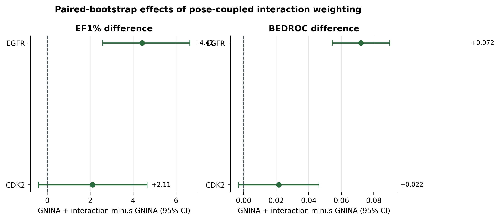
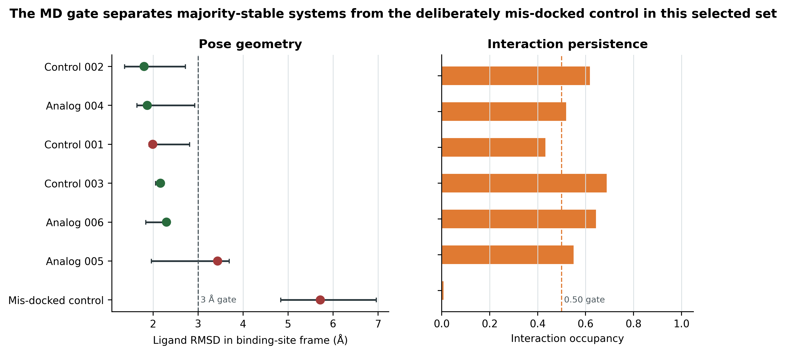
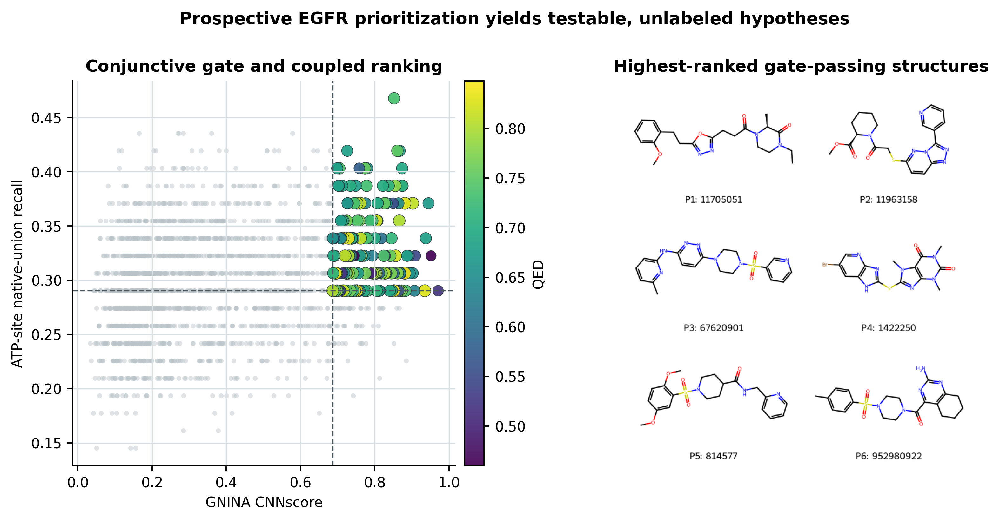

# Abstract

**Background.** Docking scores prioritize molecules without directly reporting whether the selected pose retains contacts observed in structurally characterized complexes. We tested whether a target-native interaction prior adds early-enrichment information to a learned pose score when both quantities are evaluated for the same pose.

**Methods.** Syndesis combines five-state ensemble docking, GNINA rescoring, and ProLIF fingerprints. The EGFR ATP-site interaction prior was the union of residue-by-interaction-type bits from four ATP-site holo complexes; the allosteric ligand in 6DUK was excluded while that receptor conformation remained in the docking ensemble. The development-fixed ranking rule selected the maximum, over receptor states, of CNNscore multiplied by one plus same-pose prior recall. EGFR and CDK2 DUD-E benchmarks were evaluated with paired class-stratified bootstraps, three permutation nulls, native-ligand-overlap exclusions, leave-one-receptor-out analyses, prior-definition and formula sensitivity analyses, and replicated 20 ns molecular dynamics (MD) of selected complexes.

**Results.** Strict graph-preserving fingerprint recomputation with the ATP-site-only prior raised EGFR EF1% from 11.79 for GNINA to 16.40 for pose-coupled weighting. Excluding the exact-overlap native ligand retained EF1% 15.29, and removing both AQ4 structures together retained EF1% 15.66; both paired difference intervals excluded zero. CDK2 showed a favorable EF1% difference of 2.11, although its paired 95% interval crossed zero. Twenty-one production trajectories separated a deliberately mis-docked control from four complexes that passed the majority-replicate stability rule. The prospective application produced structurally annotated hypotheses and no activity labels.

**Conclusions.** Native interaction information improved EGFR early enrichment when it was tied to the neural score of the same pose. Target transfer, permutation controls, and sensitivity analyses are necessary because the prior can encode class, ligand-size, and native-ligand-similarity structure. Syndesis produces auditable computational hypotheses, not evidence of biological activity.

**Scientific Contribution.** We introduce a pose-coupled ranking rule that augments GNINA CNNscore with recovery of a target-native interaction prior and measures its incremental contribution under paired and permutation controls. The study distinguishes native-union, conserved-core, frequency-weighted, and receptor-specific priors while auditing exact native-ligand overlap. The accompanying workflow retains pose-level evidence, parameterization warnings, and replicate-level MD decisions in machine-readable form.

**Keywords:** structure-based virtual screening; docking; interaction fingerprints; early enrichment; EGFR; CDK2; molecular dynamics

# Background

Structure-based virtual screening is a ranking problem conditioned on a pose-generation problem. Docking can sample a near-native geometry without ranking it first, and a favorable score does not establish that the selected geometry is physically credible or retains target-defining contacts [@trott2010; @amaro2018; @buttenschoen2024]. Neural scoring functions such as GNINA improve pose assessment and virtual-screening performance by learning three-dimensional protein-ligand patterns, but they remain statistical ranking models rather than direct tests of a target's crystallographic interaction evidence [@mcnutt2021; @mcnutt2025].

Protein-ligand interaction fingerprints reduce a complex to explicit residue-by-interaction descriptors. Structural interaction fingerprints, SPLIF encodings, kinase interaction profiles, and modern implementations such as ProLIF have been used to compare poses, analyze binding modes, and rescore docking results [@deng2004; @chuaqui2005; @marcou2007; @da2014; @bouysset2021]. These representations offer interpretability, but their use creates additional choices: which native complexes define the target, whether the reference is a union or a conserved core, how receptor numbering is normalized, and whether the interaction term is evaluated on the same pose as the docking score.

Kinases provide a stringent setting for this question. Their ATP pockets contain recurring hinge and catalytic interactions, while receptor conformations and ligand chemotypes remain diverse. Ensemble docking can represent this conformational heterogeneity, but maximizing over receptor states also increases the opportunity for an unrelated second score to improve a ranking mechanically [@amaro2018]. Benchmark design therefore has to separate a molecule-specific interaction contribution from class distribution, molecular size, and score-combination effects. DUD-E offers large active/decoy sets for this purpose, although its analogue and property-matched decoy construction can introduce benchmark-specific biases and is not a substitute for prospective validation [@mysinger2012; @stein2021; @wallach2018].

Syndesis was designed around one narrow hypothesis: a native-derived interaction prior can add early-enrichment information to GNINA when both terms come from the same receptor-specific pose. The primary endpoint is retrospective ranking, not activity prediction. Redocking, structural audits, replicated MD, and a ZINC-derived prospective screen are downstream evidence layers that make individual decisions inspectable; none converts a computational rank into evidence of inhibition.

# Methods

## Structural data and receptor ensembles

Protein structures were obtained from the Protein Data Bank [@berman2000]. The EGFR docking ensemble comprised receptor conformations from 1M17, 1XKK, 4HJO, 5CAV, and 6DUK, spanning active-like and inactive-like kinase states. Its ATP-site native prior was constructed only from 1M17/AQ4, 1XKK/FMM, 4HJO/AQ4, and 5CAV/4ZQ. The crystallographic JBJ-04-125-02 ligand in 6DUK is allosteric and was never used to define the ATP-site prior [@to2019]. The CDK2 transfer ensemble and prior comprised 1QMZ/ATP, 1FIN/ATP, 2A4L/RRC, 1AQ1/STU, and 1PXN/CK6; 1H00 was reserved as a structural holdout. Chain identifiers, mutations, ligand identifiers, quality decisions, pocket-state annotations, and docking-box coordinates are retained in the repository's receptor and complex tables.

For each selected structure, the documented author chain was exported with Bio.PDB and restricted to standard amino-acid residues. Co-crystallized ligands, waters, ions, cofactors, and other hetero-residues were removed from the docking receptor; pocket waters were exported separately for audit but were not retained. Ligand alternate locations were flagged during structural quality assessment; no alternate-conformer ensemble was modeled. Active-site residue and atom coverage was screened before receptor selection, and missing residues were not modeled into docking receptors. Open Babel 3.1.0 converted the cleaned chain to receptor PDBQT using `-xr -p 7.4 --partialcharge gasteiger`; this added hydrogens, applied pH 7.4 protonation, and assigned Gasteiger receptor charges. Histidine states therefore follow Open Babel's pH-dependent assignment rather than a manually selected histidine microstate. For ProLIF, the corresponding cleaned PDB was processed separately with PDBFixer at pH 7.4 to add explicit hydrogens; if needed, missing heavy atoms were repaired, but missing residues were intentionally left absent. The ProLIF run required explicit hydrogens and failed closed if this preparation was unsuccessful.

Receptors were aligned through conserved ATP-pocket residues, and residue identifiers used by interaction fingerprints were normalized through target-specific mapping tables. Missing residues contributed no bit for the affected complex; mutations retained the normalized positional identifier while preserving the observed residue name in the source table. Docking boxes were receptor specific and transferred through the aligned ATP-site frame. For 6DUK, the box was defined from that aligned ATP-site frame, not from JBJ. Keeping 6DUK as a receptor state while excluding JBJ from prior construction separates conformational sampling from interaction-prior provenance.

**Table 1.** Receptor ensembles and DUD-E benchmark sizes.

| Target | Docking receptor states | Benchmark molecules | Native-prior complexes |
|---|---|---:|---:|
| EGFR | 1M17, 1XKK, 4HJO, 5CAV, 6DUK | 35,552 (542 actives; 35,010 decoys) | 4 ATP-site complexes |
| CDK2 | 1QMZ, 1FIN, 2A4L, 1AQ1, 1PXN | 28,296 (474 actives; 27,822 decoys) | 5 |

## Ligand preparation, docking, and neural rescoring

DUD-E SMILES were parsed with their original identifiers [@mysinger2012]. RDKit generated one hydrogen-complete three-dimensional structure per input using ETKDGv3 and seed `0xF00D`; MMFF94 optimization was attempted for up to 1,000 iterations [@landrum2013; @halgren1996]. Open Babel 3.1.0 converted SDF structures to PDBQT and assigned Gasteiger charges [@oboyle2011]. Preparation failures were recorded rather than replaced by alternative chemistry.

Each ligand was docked independently against all five receptor states with Uni-Dock 1.2.0 in `balance` search mode, nine output modes, seed 807, and GPU-batched execution [@yu2023unidock]. Receptor-specific centers and dimensions are provided in the machine-readable docking-box tables. Only the top Uni-Dock pose for each ligand-receptor pair was rescored with GNINA 1.3.3 and fingerprinted; the other eight sampled modes did not enter the enrichment comparison [@mcnutt2021; @mcnutt2025]. Ligand-level ranking then selected the maximum across the five receptor-specific top poses. Thus, the benchmark evaluates receptor-state and ligand ranking after Uni-Dock pose selection; it is not a reranking of all nine generated modes and cannot rescue a lower-ranked sampled pose.

The redocking experiment was distinct from the enrichment campaign. It used 20 modes, exhaustiveness 8, seed 13, and a 2.0 Å symmetry-corrected heavy-atom RMSD threshold for a native-like pose. This separation prevents redocking pose selection from being presented as an independent prospective benchmark.

## Native-derived interaction priors

ProLIF 2.2.0 encoded interactions as normalized-residue-by-interaction-type bits [@bouysset2021]. The enrichment fingerprint classes were hydrophobic, implicit hydrogen-bond donor, implicit hydrogen-bond acceptor, anionic, cationic, cation-$\pi$, $\pi$-cation, and van der Waals contact. Configured distance limits were 4.5 Å for hydrophobic and ionic interactions and 3.6 Å for hydrogen bonds; van der Waals contacts used the configured tolerance corresponding to the 4.0 Å policy recorded with the run.

Docking PDBQT files do not preserve a complete chemical graph. For every scored pose, docked heavy-atom coordinates were therefore transferred onto the corresponding prepared SDF graph before fingerprinting. Open Babel atom reordering was recovered by matching each SDF atom to the same-element atom at the same pre-docking coordinate within 0.05 Å; Uni-Dock was then required to preserve the prepared-to-posed atom sequence. Atom-count or element-sequence mismatches, incomplete mappings, and tolerance violations failed closed. The SDF template, rather than PDBQT bond inference, supplied formal charges, bond orders, tautomerism, and stereochemistry. Controlled round trips covering neutral and charged molecules, single and multiple bonds, tetrahedral and alkene stereochemistry, and reordered atoms preserved every audited field and coordinate assignment; all 177,760 EGFR ligand-receptor poses passed reconstruction. The executable validation cases and results table are archived with the analysis.

Let $F_{i,r}$ denote the ProLIF bit set for ligand $i$ in receptor state $r$, and let $N_k$ denote the fingerprint of native complex $k$. The primary target prior was the global native union,

$$
C_{\mathrm{union}}=\bigcup_{k=1}^{K}N_k,
$$

which contained 62 bits for the four-complex EGFR ATP-site prior and 47 for CDK2. Same-pose prior recall was

$$
R_{i,r}=\frac{|F_{i,r}\cap C_{\mathrm{union}}|}{|C_{\mathrm{union}}|}.
$$

Because a union can contain contacts that are not simultaneously achievable, it is described as a *native-derived union prior*, not a consensus. Sensitivity analyses used a 60%-frequency conserved core, native-frequency weighting, a receptor-specific native fingerprint, Jaccard similarity, and each leave-one-native-complex-out union. Exact bit definitions, native frequencies, and contributing complexes are reported in repository tables.

## Pose-coupled ranking

For a ligand $i$ and receptor state $r$, the primary score was

$$
S_i(\lambda)=\max_r\left\{\mathrm{CNNscore}_{i,r}\left[1+\lambda R_{i,r}\right]\right\},
$$

with $\lambda=1$ fixed for the primary comparison after method development. Because recall lies in $[0,1]$, this value bounds the interaction multiplier between 1 and 2 and leaves the unmodified neural score as the lower bound. CNNscore and $R_{i,r}$ within each product belong to the same pose. This differs from late fusion, in which the best neural score and interaction score may come from different receptor states. Formula sensitivity covered $\lambda\in\{0,0.25,0.5,1,1.5,2,3\}$, additive combination, rank fusion, and recall, Jaccard, precision, and F1 interaction terms.

EGFR labels were available during method development; this target is therefore described as method development plus retrospective evaluation, not untouched prespecified validation. The union-recall formula, $\lambda=1$, EF1% endpoint, bootstrap design, and seed were first recorded at commit `cb7633b9` before strict graph reconstruction. The corrected permutation procedures were recorded at `50c4d971`, and the ATP-site-only prior and final analysis configuration were frozen in `configs/paper_analysis.yaml` at commit `855415ed` before the final tables were generated.

## Statistical analysis and controls

The primary endpoint was EF1%; ROC-AUC, EF5%, and BEDROC with $\alpha=80.5$ were secondary endpoints [@truchon2007]. The top set contained `round(N x fraction)` molecules, with a minimum of one, and descending ties were resolved by stable input order. A cutoff-tie audit found no effect of this policy: both EGFR arms had a boundary tie of size one, CDK2 GNINA had a boundary tie of size two containing no actives, and all fractional and 1,000 random-tie-break EF1% values equaled the reported values. Uncertainty intervals used 2,000 class-stratified bootstrap resamples with seed 807. Both methods were evaluated on the same resampled active and decoy indices, and paired differences were retained within each replicate.

Three 1,000-permutation nulls distinguished different alternative explanations. The all-ligand null reassigned each ligand's five-receptor recall vector across the complete benchmark and therefore removed label-associated recall structure. The heavy-atom-count-matched null shuffled those vectors within heavy-atom-count deciles without conditioning on activity. The class-conditional assignment null shuffled within active and decoy classes separately; it preserves class-level recall distributions and tests only whether the correct molecule-specific assignment adds information. Empirical one-sided $p$ values were calculated as $(b+1)/(1000+1)$, where $b$ is the number of null EF1% values at least as large as observed.

Robustness analyses removed each docking receptor in turn and each ATP-site native complex in turn. Duplicate native chemotypes were removed jointly by excluding both EGFR AQ4 complexes and both CDK2 ATP complexes. Native-ligand leakage was audited by canonical identity, Bemis-Murcko scaffold, and ECFP4 similarity [@bemis1996; @rogers2010]. For each target, the prior was rebuilt after excluding native complexes whose ligands were exact matches to benchmark actives. EGFR actives were stratified by maximum ECFP4 similarity to the three distinct ATP-site native ligands. Spearman correlations quantified association between union recall and heavy-atom count, molecular weight, and total pose-contact count.

## Pose audit and deterministic analog lineage

The structural audit used scaffold-holdout pose ranking and a default-deny feature policy: variables that directly encode native agreement or downstream design decisions were excluded from model training. A separate gate identified cases in which an improved score coincided with loss of interaction fidelity. Its labels were checked against a held-out interaction-loss diagnostic.

All analogs included in the reported audit were generated by deterministic RDKit transformation rules. The repository lineage table records `analog_id`, parent identifier and SMILES, analog SMILES, transformation class, generation source, selection reason, receptor, and pose identifier. The strict gate and broader interaction-loss diagnostic were treated as small-sample audits rather than calibrated activity classifiers.

## Molecular dynamics

Seven complexes (three known controls, three deterministic analogs, and one deliberately mis-docked negative control) underwent three independent 20 ns production trajectories each. These systems were selected before trajectory analysis from predefined control roles and the deterministic pre-MD analog gate. Protein parameters used AMBER ff19SB, ligand parameters used GAFF2 with AM1-BCC charges generated by AmberTools 24.8 and ACPYPE 2023.10.27, and solvent used OPC3 [@tian2020; @wang2004; @case2023; @jakalian2000; @jakalian2002; @daSilva2012; @izadi2014; @izadi2016]. ff19SB was developed and recommended with four-site OPC water; OPC3 was selected here as a related three-site optimal-point-charge model supported by the GROMACS ff19SB distribution. This pairing is documented as a practical protocol choice rather than claimed to be equivalent to the formally recommended ff19SB--OPC combination. GAFF2 parameterization warnings and net charges were retained per ligand; these open parameters are reproducible estimates, not a claim of force-field perfection.

GROMACS 2026.0 systems used dodecahedral boxes with 1.0 nm solute padding and 0.15 mol L$^{-1}$ NaCl [@abraham2015]. The seven ionized systems contained 103 sodium and 95 chloride ions, had net charge zero, and contained 32,284--32,289 water molecules. Each system underwent up to 50,000 minimization steps, 500 ps NVT equilibration at 300 K, 1 ns NPT equilibration at 1 bar, and 20 ns production with a 2 fs timestep. Replicate 1 continued equilibrated velocities; replicates 2 and 3 regenerated velocities from distinct recorded seeds. No production burn-in was discarded.

A replicate was stable only if geometric and interaction criteria passed: median ligand RMSD no greater than 3.0 Å, 95th-percentile ligand RMSD no greater than 5.0 Å, at least 90% of frames within the pocket, mean key-interaction occupancy at least 0.50, hinge occupancy at least 0.30, and binding-mode persistence at least 0.60. Candidate-level acceptance required at least two stable replicates. The analysis tests short-timescale pose persistence, not affinity or binding free energy.

## Prospective library and selection

The prospective source consisted of 36 archived ZINC22/CartBlanche22 tranche files [@irwin2020; @tingle2023]. SHA-256 checksums, filenames, record counts, and retrieval metadata are stored in a source manifest. The archive contained 103,570 rows and 103,558 unique ZINC identifiers. Molecules were required to be single fragments with supported elements, molecular weight 300--500, calculated logP 1--5, at most three hydrogen-bond donors, eight acceptors and eight rotatable bonds, topological polar surface area no greater than 110 Å$^2$, at least one aromatic nitrogen, and QED at least 0.4 [@bickerton2012]. A maximum of two molecules per Bemis-Murcko scaffold was retained in source order, after which the first 2,000 were selected. This is a deterministic tranche-derived subset, not a maximally diverse or representative sample; no random sampling or ChEMBL exclusion was applied.

The prospective set was docked and fingerprinted with the same five-state EGFR protocol. For each molecule, the pose maximizing the primary coupled score was selected first. The decision gate was then evaluated on that same pose: CNNscore at or above the selected-pose 90th percentile and union recall at or above the selected-pose median. Gate-passing compounds were ordered by the coupled score. This ordering distinguishes the top coupled-scoring compound from the top *accepted* compound and prevents a score from one receptor state from being combined with recall from another.

# Results

## Native-like poses were often sampled but not always selected

The redocking set contained 15 tasks covering 13 chemotypes and 11 Bemis-Murcko scaffolds. Twelve tasks produced a native-like pose within 2.0 Å RMSD, and the median best-pose RMSD was 1.12 Å. This is adequate evidence that the sampling procedure often placed a ligand near its reference geometry. It is not evidence that the docking rank selected that geometry.

The difference is visible in the AQ4 example: a pose at 0.83 Å was present for the 4HJO task, while the rank-1 pose was 5.81 Å from the reference. Across the 12 redocking tasks that contained a native-like pose, GNINA CNNscore had NDCG@1 0.833 (95% CI 0.583 to 1.000), compared with 0.500 (0.250 to 0.750) for docking score and 0.667 (0.417 to 0.917) for interaction recall. The confidence intervals are broad, but the result establishes the use case for post-docking evidence: pose sampling and pose selection are distinct problems.

**Table 2.** Pose ranking on redocking tasks containing a native-like sampled pose.

| Ranking signal | NDCG@1 (95% CI) | MRR |
|---|---:|---:|
| Docking score | 0.500 (0.250 to 0.750) | 0.633 |
| GNINA CNNscore | 0.833 (0.583 to 1.000) | 0.889 |
| Interaction recall | 0.667 (0.417 to 0.917) | 0.774 |

## Interaction coupling improved early EGFR enrichment

The EGFR benchmark contained 542 actives and 35,010 decoys. Five-receptor docking produced 177,760 unique ligand-receptor evaluations for 35,552 molecules. Strict coordinate-to-graph reconstruction and ProLIF evaluation succeeded for every pose; failed fingerprint rows were not imputed as zero.

GNINA was a strong baseline, with ROC-AUC 0.766, EF1% 11.79, EF5% 6.90, and BEDROC 0.208. Pose-coupled ATP-site native-union weighting increased these values to 0.772, 16.40, 7.75, and 0.282, respectively. In practical terms, GNINA retrieved 64 actives among the first 356 molecules, whereas the coupled arm retrieved 89, an increase of 25 known actives at the 1% cutoff.

**Table 3.** EGFR enrichment across the five-receptor ensemble. Intervals are percentile intervals from 2,000 class-stratified bootstrap resamples.

| Ranking arm | ROC-AUC (95% CI) | EF1% (95% CI) | EF5% (95% CI) | BEDROC (95% CI) |
|---|---:|---:|---:|---:|
| GNINA | 0.766 (0.742–0.789) | 11.79 (9.40–14.37) | 6.90 (6.12–7.71) | 0.209 (0.177–0.242) |
| **Coupled score** | **0.772 (0.749–0.796)** | **16.40 (13.63–19.35)** | **7.75 (6.90–8.49)** | **0.282 (0.244–0.319)** |

{#fig-structural width=100% fig-alt="Four structural panels showing a native EGFR complex, redocked poses, a weak-interaction decoy pose, and an interaction-consistent active pose."}

{#fig-enrichment width=100% fig-alt="Bar charts for ROC-AUC, EF1%, and BEDROC across EGFR and CDK2 ranking arms."}

All paired contrasts favored the coupled arm. The EF1% gain was 4.61 (95% CI 2.58–6.82), the EF5% gain was 0.85 (0.44–1.18), the ROC-AUC gain was 0.0063 (0.0047–0.0079), and the BEDROC gain was 0.0736 (0.0559–0.0915). Every bootstrap difference was positive for each metric.

The three permutation nulls answered different questions. An unrestricted all-ligand shuffle gave mean EF1% 11.35 (95% permutation range 9.95–12.90), corresponding to an observed-minus-null increment of 5.05 and empirical $p=0.0010$. Heavy-atom-count matching gave mean 12.39 (10.87–13.82), increment 4.01, and $p=0.0010$. The class-conditional assignment null was more stringent because it preserved active-decoy recall differences: its mean was 14.26 (12.90–15.66), leaving an increment of 2.13 and $p=0.0040$. The latter is therefore a class-conditional molecule-assignment test, not a general random-score null.

{#fig-permutation width=100% fig-alt="Permutation distributions of EF1 percent for EGFR and CDK2, with observed coupled-score enrichment marked."}

No single docking receptor explained the effect. Across all five leave-one-receptor-out analyses, EF1% gains ranged from 3.50 to 4.97 and all paired 95% intervals excluded zero. Excluding the 6DUK receptor state yielded GNINA EF1% 11.98 and coupled EF1% 16.40, a difference of 4.42 (2.58–6.63); JBJ was absent from the primary prior in this and every other analysis.

{#fig-receptor-sensitivity width=92% fig-alt="Heatmaps of EF1 percent differences after excluding each EGFR or CDK2 receptor."}

Native-ligand overlap did not account for the EGFR result. FMM from 1XKK was identical to one DUD-E active (maximum ECFP4 Tanimoto 1.0 and a matching Bemis-Murcko scaffold); the other ATP-site native ligands had no exact identity. Rebuilding the prior without 1XKK/FMM gave EF1% 15.29, with a paired improvement over GNINA of 3.50 (95% CI 1.84–5.53). Removing both AQ4 complexes together gave EF1% 15.66 and a paired improvement of 3.87 (1.29–6.26). Across the four individual ATP-site-complex exclusions, EF1% ranged from 15.29 to 17.32. Alternative definitions gave EF1% 17.14 for the 60% conserved core, 16.58 for frequency weighting, 16.03 for union Jaccard, and 16.95 for receptor-specific recall.

The gain was not confined to close native chemotypes. Of 542 EGFR actives, 369 had maximum ECFP4 similarity below 0.30 to all three distinct ATP-site native ligands; the coupled ranking recovered 54 of these low-similarity actives in the global top 1%, compared with 39 for GNINA. Recovery increased from 25 to 31 among the 163 actives in the 0.30–0.50 stratum. The two higher-similarity strata contained only ten actives and were reported descriptively rather than used to infer a trend.

ATP-site union recall was correlated weakly with heavy-atom count ($\rho=0.158$) and molecular weight ($\rho=0.160$) across all receptor-specific poses, and more strongly with total detected contacts ($\rho=0.569$). For the selected coupled pose per ligand, the corresponding correlations were 0.194, 0.197, and 0.590. The heavy-atom-count-matched null addresses part of this size structure; the contact-count correlation remains a reason to report alternative normalized interaction terms rather than interpret union recall as a size-free quantity.

Formula sensitivity did not identify $\lambda=1$ as a uniquely favorable setting. Within the multiplicative recall family, EF1% rose from 13.45 at $\lambda=0.25$ to 18.24 at $\lambda=3$; the development-fixed $\lambda=1$ result lay within this monotonic range. Additive and rank-fusion variants also improved early enrichment for several interaction terms. These analyses support complementarity but do not establish a universal functional form or weight.

{#fig-deltas width=82% fig-alt="Forest plots of coupled score minus GNINA differences for EGFR and CDK2."}

## CDK2 tested the boundary of the claim

The same score definition was applied to CDK2, using an independently constructed CDK2 native interaction reference. The benchmark contained 474 actives and 27,822 decoys. EF1% increased from 10.97 for GNINA to 13.08 for the coupled score, corresponding to 52 versus 62 actives among the first 283 molecules. The paired difference was +2.11, but its 95% CI ranged from -0.42 to 4.64. ROC-AUC increased by 0.0042 (0.0023–0.0060), whereas the BEDROC difference of 0.0217 had an interval spanning -0.0033 to 0.0463.

**Table 4.** CDK2 enrichment. The EF1% direction is favorable, but the paired contrast is unresolved.

| Ranking arm | ROC-AUC (95% CI) | EF1% (95% CI) | EF5% (95% CI) | BEDROC (95% CI) |
|---|---:|---:|---:|---:|
| GNINA | 0.747 (0.718–0.774) | 10.97 (8.44–13.71) | 6.62 (5.82–7.47) | 0.222 (0.186–0.258) |
| Coupled score | 0.751 (0.723–0.778) | 13.08 (10.13–16.24) | 7.05 (6.24–7.89) | 0.243 (0.205–0.280) |

This is an important boundary rather than a negative result to be hidden. All three CDK2 permutation tests placed the observed EF1% above their null means (empirical $p=0.0010$, 0.0140, and 0.0220 for unrestricted, heavy-atom-count-matched, and class-conditional assignment), but receptor exclusions were heterogeneous: excluding 1AQ1 gave a difference of -0.21, whereas excluding 1FIN gave +3.16. The permutation tests ask whether the observed interaction assignment exceeds randomized assignments, whereas the paired bootstrap asks whether the coupled method reliably exceeds GNINA; these are distinct comparisons. Removing both exact-overlap inhibitor complexes, 2A4L/RRC and 1AQ1/STU, reduced EF1% to 12.45; the paired difference from GNINA was 1.48 (95% CI -0.85 to 4.22). ATP was included because it reports the natural ATP-site interaction geometry rather than an inhibitor chemotype. Removing both ATP complexes together also gave EF1% 12.45, with a difference of 1.48 (-1.27 to 3.80). The evidence therefore does not establish a receptor-independent or target-agnostic gain; it supports evaluating the incremental contribution separately for each target and ensemble.

## Structural audits made ranking failures inspectable

The scaffold-holdout pose ranker achieved NDCG@3 0.667 (95% CI 0.465 to 0.856), versus 0.395 (0.203 to 0.610) for docking. A single key-interaction recall feature achieved 0.748 (0.585 to 0.897). The model should therefore be understood as an evidence combiner, not as a demonstrated improvement over the strongest individual structural feature.

The manuscript analysis was restricted to 17 analogs generated by deterministic RDKit transformations, of which six passed the pre-MD gate. Three score-improved analogs lost more than 0.01 in the held-out interaction-fidelity measure; the gate-coupled detector identified all three without a false positive in this set. At a 0.02 loss threshold only one case remained, and detector precision was 0.33 because two milder losses were still flagged. No analog crossed a 0.05 loss threshold. These 17 examples are too few to calibrate a classifier, but the threshold sweep makes the decision sensitivity explicit. Complete molecular lineage, including parent and analog SMILES, transformation rules, and selected pose identifiers, is available as a machine-readable table.

## Replicated MD distinguished pose persistence from pocket confinement

The MD gate considered ligand RMSD together with hinge and key-contact occupancy. Three systems were stable in all replicates, one was stable in two of three, and three were unstable in all completed replicates. The deliberately mis-docked control was the most informative negative: its median ligand RMSD was 5.72 Å and its median key-interaction occupancy was 0.008, yielding no stable replicates. By contrast, the correctly docked control 002 completed three stable replicates with median ligand RMSD 1.80 Å and median key-interaction occupancy 0.618.

The gate also rejected a control with modest geometric displacement but insufficient interaction persistence. This demonstrates why RMSD alone is inadequate for this application: a ligand can remain near the pocket while failing to retain the interactions that motivated its original pose.

**Table 5.** Candidate-level MD summary. These simulations are pose triage, not binding-free-energy calculations.

| System | Completed replicates | Stable replicates | Median ligand RMSD, Å | Median key-interaction occupancy | Final label |
|---|---:|---:|---:|---:|---|
| Known control 001 | 3 | 0 | 1.99 | 0.433 | unstable |
| Known control 002 | 3 | 3 | 1.80 | 0.618 | stable |
| Known control 003 | 3 | 3 | 2.16 | 0.688 | stable |
| Analog 004 | 3 | 2 | 1.87 | 0.519 | stable |
| Analog 005 | 3 | 0 | 3.43 | 0.550 | unstable |
| Analog 006 | 3 | 3 | 2.30 | 0.644 | stable |
| Mis-docked negative control | 3 | 0 | 5.72 | 0.008 | unstable |

{#fig-md width=100% fig-alt="Ligand RMSD and interaction occupancy summaries for molecular dynamics systems."}

## The prospective screen produced hypotheses, not labels

The archived ZINC tranche collection contained 103,570 rows and 103,558 unique identifiers. The property filter retained 25,870 molecules, and the two-per-scaffold cap retained 21,599. The first 2,000 records in deterministic source order were selected, of which 1,993 yielded complete five-receptor scores and strict fingerprints. The selected-pose thresholds were CNNscore 0.7051 and ATP-site native-union recall 0.2903; 139 compounds passed both. The top 50 gate-passing compounds represented 50 distinct Bemis-Murcko scaffolds.

This endpoint is intentionally modest. The output is a deterministic tranche-derived set with recorded structural rationale, not a set of predicted actives or a verified availability catalogue. The highest coupled-scoring candidate, ZINC11705051, passed the gate with CNNscore 0.945, interaction recall 0.371, and coupled score 1.296. These values prioritize a pose for inspection and experimental testing, but do not establish affinity, selectivity, or current vendor availability.

{#fig-prospective width=100% fig-alt="Scatter plot of prospective ZINC candidates and a grid of the six highest-ranked molecular structures."}

# Discussion

The central result is specific. On the EGFR benchmark, ATP-site native-union recovery improved early enrichment when it was coupled to the neural score of the same pose. The paired bootstrap, three permutation designs, five docking-receptor exclusions, four ATP-site native-complex exclusions, joint AQ4 exclusion, and native-similarity strata address sampling variation, generic score combination, molecular size, label-associated recall, receptor dependence, and native-ligand overlap. Together they support an EGFR ranking improvement, not a general claim that interaction fingerprints solve docking.

The CDK2 analysis prevents overgeneralization. Its EF1% direction was favorable, but the paired uncertainty interval crossed zero and receptor exclusions were heterogeneous. The correct interpretation is not that the EGFR effect was reproduced without qualification. It is that the workflow exposes where a target-specific interaction prior may be useful and where its evidence remains incomplete.

The form of the interaction prior matters. A global union is inclusive and robust to omission of one native complex, but it may combine contacts that no single ligand can satisfy and is strongly associated with the total number of detected contacts. A frequency-weighted or receptor-specific term performed at least as well on EGFR, while higher multiplicative weights and several additive rules produced still higher EF1% values. Those observations are sensitivity results, not a license to tune against the benchmark. The $\lambda=1$ union-recall rule remains the primary analysis because it was fixed before the final strict fingerprint recomputation and has a direct interpretation.

The downstream results are similarly bounded. The deterministic analog audit is a small-sample diagnostic. The MD calculations test short-term pose persistence and interaction retention, not binding affinity, kinetics, or residence time. The prospective compounds are screening hypotheses. Parameterization and MD use an open AMBER/GAFF2 workflow, which is documented and reproducible but not a claim of force-field perfection.

# Conclusions

Syndesis adds a target-native interaction check to ensemble docking and GNINA rescoring without discarding either source of evidence. On EGFR, the pose-coupled rule improved EF1%, EF5%, ROC-AUC, and BEDROC relative to GNINA; the effect survived unrestricted, heavy-atom-count-matched, and class-conditional permutation nulls, every receptor exclusion, removal of the exact native/DUD-E ligand overlap, and joint removal of duplicate AQ4 complexes. The workflow is best viewed as a framework for auditable structural prioritization: it records why a candidate was retained, why another was rejected, and what remains to be established experimentally.

# Abbreviations

ATP, adenosine triphosphate; BEDROC, Boltzmann-enhanced discrimination of receiver operating characteristic; CDK2, cyclin-dependent kinase 2; CNN, convolutional neural network; DUD-E, Directory of Useful Decoys--Enhanced; ECFP, extended-connectivity fingerprint; EF, enrichment factor; EGFR, epidermal growth factor receptor; GAFF2, second-generation General Amber Force Field; IFP, interaction fingerprint; MD, molecular dynamics; MRR, mean reciprocal rank; NDCG, normalized discounted cumulative gain; OPC3, three-point optimal point-charge water model; QED, quantitative estimate of drug-likeness; RMSD, root-mean-square deviation; ROC-AUC, area under the receiver-operating-characteristic curve; SIFt, structural interaction fingerprint.

# Declarations

## Availability of data and materials

Source code, workflow configurations, tests, figures, the rendered manuscript, and machine-readable supporting data are available at [https://github.com/eva-mitropoulou/Syndesis](https://github.com/eva-mitropoulou/Syndesis). The exact paper package is the [v1.0.2-paper release](https://github.com/eva-mitropoulou/Syndesis/releases/tag/v1.0.2-paper). It includes selected protein-ligand pose coordinates, native interaction-bit tables, ligand-level benchmark scores and fingerprints, all bootstrap and permutation draws, leave-one-out analyses, the prospective input and ranking, analog lineage, controlled graph-mapping validation, path-independent ligand parameters and GROMACS topologies, all MD protocol files, replicate-level gate metrics, and per-frame geometric and interaction time series. Raw structures and benchmark molecules originate from the PDB, DUD-E, and ZINC22 and remain subject to their source terms. Large docking intermediates and trajectories are excluded; source manifests, checksums, versioned inputs, and deterministic rebuild scripts are provided instead. No separate supplementary document accompanies this manuscript.

## Competing interests

The authors declare no competing interests.

## Funding

This research received no specific grant from any funding agency in the public, commercial, or not-for-profit sectors.

## Authors' contributions

Following the CRediT taxonomy: E.M., conceptualization, methodology, software, formal analysis, investigation, data curation, visualization, writing--original draft, and writing--review and editing; D.G., conceptualization, methodology, validation, resources, supervision, project administration, and writing--review and editing. Both authors read and approved the manuscript.

## Ethics approval and consent to participate

Not applicable.

## Consent for publication

Not applicable.

## Acknowledgements

The authors acknowledge the developers and maintainers of the open scientific software and public structural and chemical databases used in this study.
