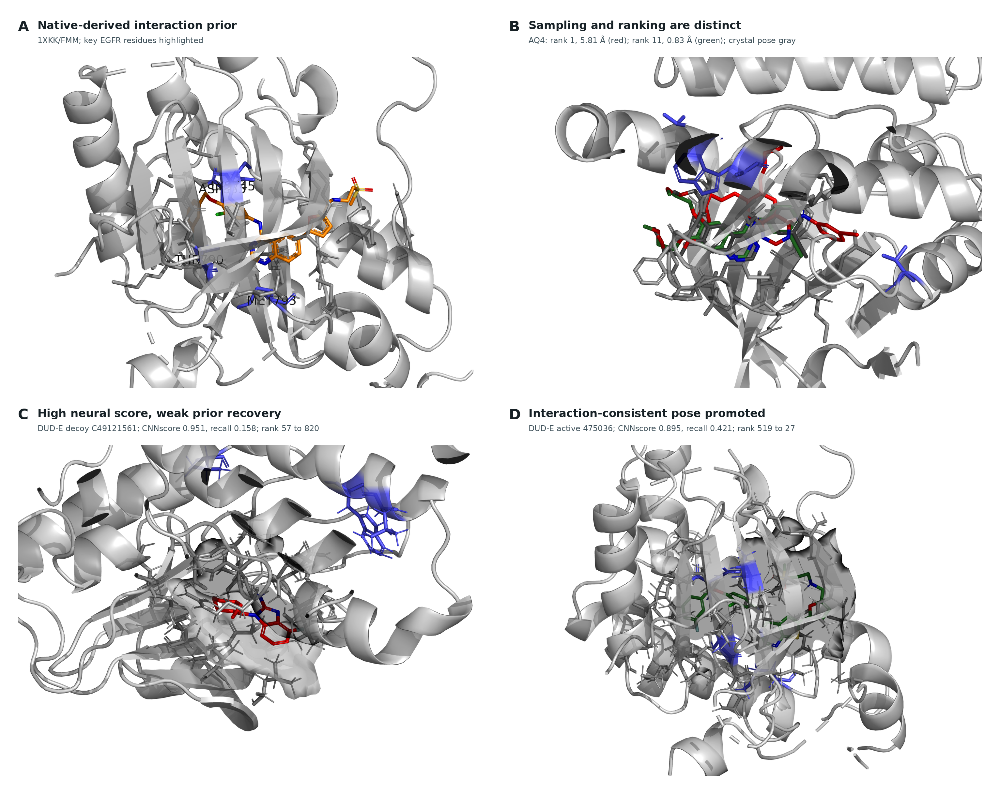
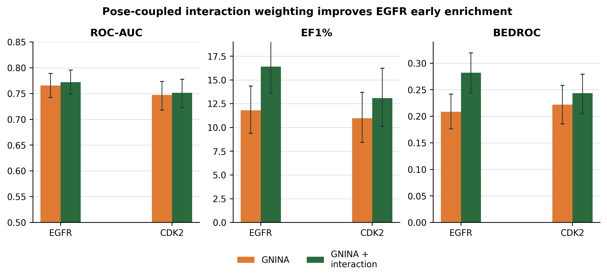
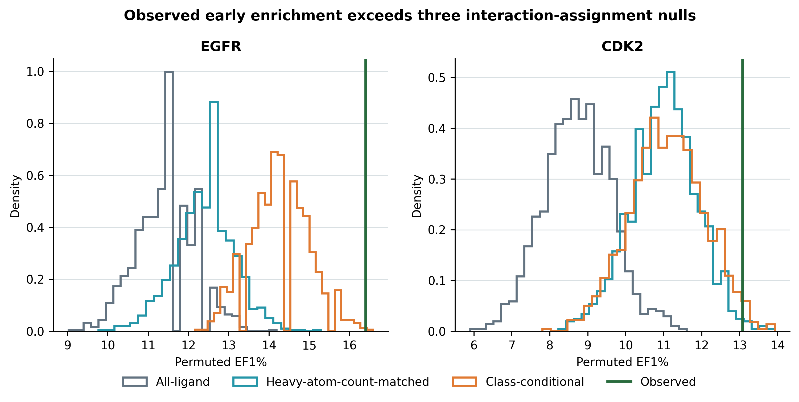
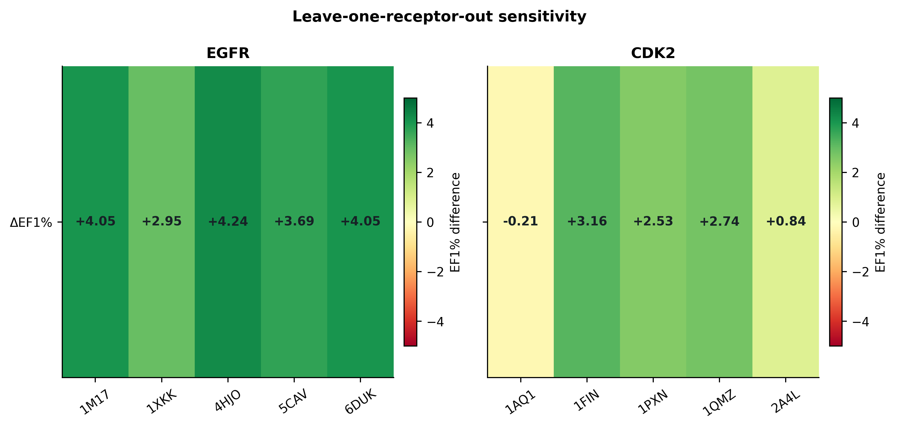

# Abstract

**Background.** Docking and neural rescoring can rank ligands without establishing whether the selected receptor-specific pose recovers interactions observed in target holo structures. We asked whether a target-native interaction prior adds incremental early-enrichment information to GNINA when both signals are evaluated on the same pose.

**Methods.** Syndesis combined four-state EGFR ensemble docking, GNINA CNNscore, and ProLIF interaction fingerprints. A native-derived ATP-site union prior was constructed from the same four EGFR holo complexes. The primary ligand score was the maximum, across those receptor states, of CNNscore multiplied by one plus same-pose interaction recall. The scoring rule was developed and fixed on EGFR and subsequently applied unchanged to CDK2 as a target-transfer evaluation. We used paired class-stratified bootstraps, three permutation controls, receptor and native-complex exclusions, exact native-ligand-overlap audits, and similarity and size analyses. The original five-receptor ensemble including 6DUK was retained only as a sensitivity analysis.

**Results.** Pose-coupled weighting increased four-receptor EGFR EF1% from 11.98 to 16.40, recovering 89 rather than 65 actives among the first 356 ranked molecules. The paired EF1% difference was 4.42 (95% CI 2.58 to 6.63). The effect exceeded unrestricted, heavy-atom-count-matched, and class-conditional assignment nulls; it persisted after every primary-receptor exclusion, removal of the exact-overlap native ligand, and joint removal of duplicate AQ4 complexes. Adding 6DUK only in a five-receptor sensitivity analysis did not materially change the conclusion. The chemically coherent four-receptor CDK2 analysis showed a favorable but conservative EF1% difference of 2.74 (95% CI 0.00 to 5.06).

**Conclusions.** A target-native interaction prior can improve EGFR early enrichment when interaction recall and neural score are coupled to the same receptor-specific pose. The result is target- and ensemble-dependent rather than evidence for a universal rescoring rule.

**Scientific Contribution.** We introduce and evaluate a pose-coupled native-interaction weighting rule that exposes the structural evidence behind a neural docking score. Paired and permutation controls distinguish its EGFR early-enrichment signal from score-combination, molecular-size, class-distribution, receptor, and native-ligand-overlap effects.

**Keywords:** structure-based virtual screening; docking; interaction fingerprints; early enrichment; EGFR; CDK2

# Background

Structure-based virtual screening is a ranking problem conditioned on pose generation. A docking program may sample a near-native geometry without ranking it first, and a favorable score alone does not establish that the selected pose is structurally credible [@trott2010; @amaro2018; @buttenschoen2024]. Neural scoring functions such as GNINA improve pose assessment by learning protein-ligand patterns from three-dimensional data, but their outputs remain statistical scores rather than explicit tests of whether a pose retains contacts characteristic of a target [@mcnutt2021; @mcnutt2025].

Protein-ligand interaction fingerprints provide that explicit representation. SIFt, SPLIF, kinase interaction profiles, and tools such as ProLIF encode complexes as residue-by-interaction descriptors and have been used for pose comparison, binding-mode analysis, and rescoring [@deng2004; @chuaqui2005; @marcou2007; @da2014; @bouysset2021]. Prior fingerprint-based methods commonly compare a docked pose with a reference pattern after docking. The unresolved methodological issue is how to combine this reference evidence with a learned score across a receptor ensemble.

That combination must preserve pose identity. If the highest neural score is taken from one receptor state and the highest interaction value from another, their combination can reward two incompatible poses. The resulting late-fusion score is not evidence for any single protein-ligand geometry and may gain enrichment mechanically as the number of receptor states grows. We instead evaluate both terms for the same ligand, receptor state, and docked pose before maximizing over receptor states.

Syndesis was designed around one narrow hypothesis: a native-derived interaction prior can add early-enrichment information to GNINA when both terms are evaluated for the same receptor-specific pose. EGFR served as the method-development and primary retrospective-evaluation target, whereas CDK2 was used as a target-transfer evaluation after the scoring rule and primary analysis choices had been fixed. The primary endpoint was retrospective ranking rather than activity prediction. Redocking, structural audits, replicated MD, and a ZINC-derived prospective screen provided downstream evidence layers that made individual decisions inspectable; none converted a computational rank into evidence of inhibition.

# Methods

## Study design and structural inputs

The primary study was a paired comparison between GNINA and a pose-coupled GNINA-plus-interaction score on the same EGFR ligand-receptor evaluations. The primary EGFR docking ensemble comprised 1M17, 1XKK, 4HJO, and 5CAV. These four ATP-site holo structures also defined the native-derived interaction prior (1M17/AQ4, 1XKK/FMM, 4HJO/AQ4, and 5CAV/4ZQ). The distinct 6DUK conformation was excluded from the primary ensemble to avoid introducing an allosteric-ligand-stabilized receptor state into the main comparison. The original five-receptor ensemble including ligand-stripped 6DUK was retained only as a sensitivity analysis [@to2019]. CDK2 used 1QMZ/ATP, 1FIN/ATP, 2A4L/RRC, 1AQ1/STU, and 1PXN/CK6; 1H00 was held out. Receptor identities, chains, docking boxes, quality decisions, and residue maps are machine-readable in the release.

EGFR receptor chains were prepared from PDB structures [@berman2000], with non-protein residues removed and Open Babel 3.1.0 used to produce pH 7.4, Gasteiger-charged PDBQT receptors. For docked-pose fingerprints, the ProLIF protein was regenerated from the exact docking PDBQT by Open Babel; ProLIF then assigned residue, aromatic, donor, and acceptor chemical perception to that docking-derived model. The four primary receptors had identical docking and ProLIF heavy-atom sets and zero ProLIF-only atoms. The CDK2 chain-A extractor represented 1QMZ without HETATM phosphothreonine TPO160; the 1QMZ-excluded result is therefore treated as a sensitivity analysis rather than a phosphorylated-CDK2 model.

**Table 1.** Receptor ensembles, benchmark sizes, and native-prior complexes.

| Target | Docking receptor states | Benchmark molecules | Native-prior complexes |
|---|---|---:|---:|
| EGFR | 1M17, 1XKK, 4HJO, 5CAV | 35,552 (542 actives; 35,010 decoys) | 4 ATP-site complexes |
| CDK2 | 1FIN, 2A4L, 1AQ1, 1PXN | 28,296 (474 actives; 27,822 decoys) | 5 native complexes |

## Docking, interaction encoding, and score coupling

DUD-E input SMILES were converted to one ETKDGv3/MMFF94-optimized three-dimensional state per record and then to PDBQT with Open Babel [@mysinger2012; @landrum2013; @halgren1996; @oboyle2011]. Alternative protomers, tautomers, stereoisomers, and conformers were not enumerated. Each ligand was docked independently to 1M17, 1XKK, 4HJO, and 5CAV with Uni-Dock 1.2.0 in `balance` mode, nine output modes, and seed 807 [@yu2023unidock]. Only the top Uni-Dock pose per ligand-receptor pair entered the enrichment analysis; GNINA 1.3.3 rescored that pose [@mcnutt2021; @mcnutt2025].

ProLIF 2.2.0 encoded hydrophobic, implicit donor and acceptor, ionic, cation-pi, pi-cation, and van der Waals interactions as normalized residue-by-interaction-type bits [@bouysset2021]. Docked coordinates were transferred onto the prepared SDF graph before fingerprinting, preserving bond order, formal charge, tautomerism, and stereochemistry. Atom-order, element, count, and coordinate-mapping failures were not converted to zero scores; all 142,208 primary EGFR ligand-receptor evaluations passed this reconstruction audit.

Let $F_{i,r}$ be the fingerprint for ligand $i$ in receptor state $r$, and $N_k$ the fingerprint for native complex $k$. The primary prior was the target-native union $C=\bigcup_k N_k$, with 62 EGFR and 47 CDK2 bits. Same-pose recall was $R_{i,r}=|F_{i,r}\cap C|/|C|$. The coupled ligand score was

$$
S_i=\max_r\{\mathrm{CNNscore}_{i,r}[1+R_{i,r}]\}.
$$

The multiplier is bounded between one and two. Critically, CNNscore and recall in each product belong to the same pose. EGFR labels informed method development, so EGFR is reported as the method-development and primary retrospective-evaluation target. The scoring rule (multiplicative union recall with $\lambda=1$), EF1% endpoint, bootstrap design, and seeds were fixed before final strict fingerprint recomputation and were then applied unchanged to CDK2 for target-transfer evaluation. Alternative priors and formulas were sensitivity analyses, not selection criteria.

## Statistical evaluation

EF1% was the primary endpoint; ROC-AUC, EF5%, and BEDROC ($\alpha=80.5$) were secondary [@truchon2007]. The top 1% set used $\operatorname{round}(0.01N)$ molecules, with stable input order resolving score ties. We used 2,000 paired class-stratified bootstrap resamples (seed 807). Three 1,000-draw permutation controls reassigned complete receptor-ensemble recall vectors: across all ligands, within heavy-atom-count deciles, and within activity class. The last preserves active-decoy recall distributions and tests molecule-specific assignment rather than a general random-score null. Receptor exclusions, native-complex exclusions, joint duplicate-chemotype exclusions, exact native/DUD-E identity checks, ECFP4 similarity strata, and recall-size correlations tested robustness [@bemis1996; @rogers2010]. The five-receptor 6DUK-inclusive result was evaluated separately as an ensemble sensitivity. DUD-E decoys are property-matched benchmark compounds rather than experimentally confirmed inactives, and its analogue and decoy construction can introduce benchmark-specific bias; this analysis therefore evaluates incremental ranking performance, not prospective activity prediction [@mysinger2012; @stein2021; @wallach2018].

# Results

## Redocking motivates pose-coupled evidence

Redocking separated pose sampling from pose selection. In one AQ4 task, a 0.83 A pose was sampled while the top-ranked docking pose was 5.81 A from the reference. Across 12 tasks containing a native-like sampled pose, GNINA CNNscore achieved NDCG@1 of 0.833 (95% CI 0.583 to 1.000), compared with 0.500 (0.250 to 0.750) for docking score. This does not validate the enrichment rule, but establishes why evidence attached to the selected pose matters.

{#fig-structural width=100% fig-alt="Structural panels showing a native EGFR complex, a redocking rank discrepancy, a weak-interaction decoy, and an interaction-consistent pose."}

## Pose-coupled weighting improves EGFR early enrichment

The EGFR benchmark comprised 542 actives and 35,010 decoys. Across the four-receptor primary ensemble, GNINA achieved EF1% 11.98, retrieving 65 actives among the first 356 molecules. The coupled score achieved EF1% 16.40 and retrieved 89 actives. The paired EF1% improvement was 4.42 (95% CI 2.58 to 6.63); ROC-AUC, EF5%, and BEDROC also increased.

**Table 2.** EGFR enrichment across the four-receptor primary ensemble. Intervals are percentile 95% confidence intervals from 2,000 class-stratified bootstrap resamples.

| Ranking arm | ROC-AUC (95% CI) | EF1% (95% CI) | EF5% (95% CI) | BEDROC (95% CI) |
|---|---:|---:|---:|---:|
| GNINA | 0.770 (0.746-0.794) | 11.98 (9.40-14.56) | 7.01 (6.27-7.78) | 0.210 (0.178-0.244) |
| **Pose-coupled score** | **0.775 (0.751-0.798)** | **16.40 (13.63-19.35)** | **7.71 (6.90-8.52)** | **0.282 (0.245-0.320)** |

{#fig-enrichment width=100% fig-alt="Enrichment metrics for GNINA and pose-coupled scoring on EGFR and CDK2."}

The gain exceeded all three nulls. All-ligand reassignment gave mean EF1% 11.35 (empirical $p=0.0010$); heavy-atom-count matching gave 12.40 ($p=0.0010$); and the more stringent class-conditional assignment null gave 14.27 ($p=0.0040$). Thus, the result is not explained by a generic score combination, ligand-size matching, or active-decoy class distributions alone.

{#fig-permutation width=100% fig-alt="Permutation distributions with observed pose-coupled enrichment marked for EGFR and CDK2."}

## Robustness analyses localize the scope of the EGFR result

No single primary receptor explained the effect: leave-one-receptor-out EF1% gains ranged from 3.50 to 4.79, with all paired intervals excluding zero. Removing the exact-overlap FMM native ligand retained EF1% 15.29 and a paired gain of 3.32 (95% CI 1.84 to 5.34); removing both AQ4 complexes retained EF1% 15.66 and a gain of 3.69 (1.11 to 6.08). Among 369 actives with maximum ECFP4 similarity below 0.30 to every distinct native ligand, the coupled ranking recovered 54 in the global top 1%, compared with 39 for GNINA.

Recall correlated with heavy-atom count ($\rho=0.218$) and molecular weight ($\rho=0.221$), and more strongly with total detected contacts ($\rho=0.704$). This motivates the heavy-atom-count-matched null and prevents interpreting union recall as size-free. Conserved-core, frequency-weighted, Jaccard, and receptor-specific priors also improved EGFR enrichment; these are robustness observations, not evidence that one weighting formula is universally optimal.

Across $\lambda=0.25$ to $3$ in $\mathrm{CNNscore}[1+\lambda R]$, the EGFR direction remained positive (EF1% 13.82 to 18.24); $\lambda=1$ was the development-fixed primary value rather than the empirically optimal value.

## Five-receptor ensemble sensitivity

The original ensemble was re-evaluated separately by adding ligand-stripped 6DUK to the four primary receptor states while retaining the same ATP-site prior. Its GNINA EF1% was 11.79 and its coupled EF1% was 16.40, for a paired difference of 4.61 (95% CI 2.58 to 6.82). Thus, 6DUK changed the GNINA-selected baseline slightly but did not change the coupled top-1% active count (89) or the conclusion that same-pose interaction coupling improves EGFR early enrichment. This sensitivity result is not part of the primary protocol.

{#fig-receptor-sensitivity width=92% fig-alt="Receptor-exclusion effects on coupled-score EF1% differences."}

## CDK2 defines a transfer boundary

CDK2 was used to test transfer of the EGFR-developed scoring rule to a second kinase target. The primary CDK2 ensemble excluded 1QMZ because the extraction workflow removed phosphothreonine TPO160. Across 1FIN, 2A4L, 1AQ1, and 1PXN, coupled scoring increased EF1% from 11.39 to 14.13, corresponding to a paired difference of 2.74 (95% CI 0.00 to 5.06). The five-receptor result including the altered 1QMZ representation is retained as a sensitivity analysis. Native-prior overlap remained unresolved: joint removal of the two ATP complexes gave EF1% 12.45 (paired difference 1.48; 95% CI -1.27 to 3.80), while removal of exact-overlap inhibitor complexes gave EF1% 12.45 (difference 1.48; -0.85 to 4.22). These sensitivity results reinforce that CDK2 transfer should be interpreted conservatively.

# Discussion

The main finding is methodological and specific: a native-derived interaction prior improved EGFR early enrichment when it was coupled to the GNINA score of the same receptor-specific pose. Same-pose coupling is essential because a receptor ensemble otherwise permits score components from incompatible poses to be combined. The paired comparison and three null designs show that the observed gain is not adequately described as a mechanical consequence of adding another score, preserving class-level recall distributions, or matching ligand size.

The robustness analyses also refine the biological interpretation. The effect survived removal of individual receptor states, exact native-ligand overlap, and duplicate AQ4 structures, and remained visible among low-similarity actives. These results support the view that the prior contributes target-structural information rather than merely recognizing one crystallographic chemotype. At the same time, union recall depends on the number of detected contacts and different prior definitions also perform well. The appropriate conclusion is not that native-union recall is uniquely correct, but that explicit target-native interaction evidence can complement a learned score.

CDK2 sets the boundary of the claim. Its point estimates are favorable, but the paired EF1% interval crosses zero and receptor dependence is substantial. Transfer should therefore be evaluated target by target rather than assumed from kinase-family membership. The one-state ligand-preparation strategy is an additional practical limitation because alternative protonation, tautomeric, stereochemical, and conformational states can affect both docking and interaction recovery. Likewise, DUD-E is external to Syndesis development but not necessarily independent of GNINA training structures or chemistry; this study estimates the incremental value of coupling on these benchmarks, not absolute GNINA generalization.

# Conclusions

Pose-coupled native-interaction weighting improved EGFR early enrichment beyond GNINA across paired, permutation, four-primary-receptor exclusion, native-overlap, and similarity controls. Adding 6DUK only as a sensitivity state did not materially alter that conclusion. The result supports a focused principle for ensemble docking: interaction evidence should be evaluated on the same pose as the score it modifies. Its unresolved CDK2 transfer result argues for target-specific evaluation, not a universal rescoring claim.

# Abbreviations

ATP, adenosine triphosphate; BEDROC, Boltzmann-enhanced discrimination of receiver operating characteristic; CDK2, cyclin-dependent kinase 2; CNN, convolutional neural network; DUD-E, Directory of Useful Decoys--Enhanced; ECFP, extended-connectivity fingerprint; EF, enrichment factor; EGFR, epidermal growth factor receptor; IFP, interaction fingerprint; MD, molecular dynamics; NDCG, normalized discounted cumulative gain; ROC-AUC, area under the receiver-operating-characteristic curve.

# Declarations

## Availability of data and materials

Source code, workflow configurations, tests, figures, the rendered manuscript, and machine-readable supporting data are available at [https://github.com/eva-mitropoulou/Syndesis](https://github.com/eva-mitropoulou/Syndesis). The exact paper package is the [v1.1.5-paper release](https://github.com/eva-mitropoulou/Syndesis/releases/tag/v1.1.5-paper). It includes pose coordinates, native interaction-bit tables, ligand-level benchmark scores and fingerprints, bootstrap and permutation draws, exclusion analyses, graph-mapping validation, and the four-receptor primary manifests. Raw structures and benchmark molecules originate from the PDB and DUD-E and remain subject to their source terms. No separate supplementary document accompanies this manuscript.

## Competing interests

The authors declare no competing interests.

## Funding

This research received no specific grant from any funding agency in the public, commercial, or not-for-profit sectors.

## Authors' contributions

Following the CRediT taxonomy: E.M., conceptualization, methodology, software, formal analysis, investigation, data curation, visualization, writing--original draft, and writing--review and editing; D.G., conceptualization, methodology, validation, resources, supervision, project administration, and writing--review and editing. Both authors read and approved the manuscript.

## Ethics approval and consent to participate

Not applicable.

## Consent for publication

Not applicable.

## Acknowledgements

The authors acknowledge the developers and maintainers of the open scientific software and public structural and chemical databases used in this study.
