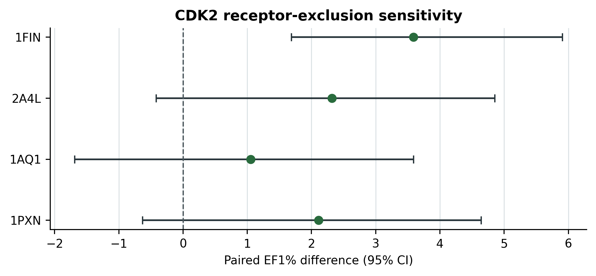

# Abstract

**Background.** Ensemble docking can assign a high neural score to a ligand without showing whether the selected receptor-specific pose recovers interactions observed in target holo structures. We tested whether explicit recovery of target-native interactions adds early-ranking information to GNINA when both signals are evaluated for the same pose.

**Methods.** Syndesis docked the EGFR DUD-E benchmark against four ATP-site holo structures, rescored the top Uni-Dock pose from each receptor with GNINA, and encoded interactions with ProLIF. Four native complexes defined a 62-feature union prior. For each receptor-specific pose, CNNscore was multiplied by one plus native-interaction recall, and the maximum coupled score determined ligand ranking. The rule was developed on EGFR and applied unchanged to a four-receptor CDK2 transfer benchmark. Evaluation included paired bootstrapping, three interaction-assignment permutation controls, exclusion and similarity analyses, and three independent 20 ns MD trajectories for seven systems.

**Results.** On EGFR, pose-coupled weighting increased EF1% from 11.98 to 16.40 and recovered 89 versus 65 actives among the first 356 molecules. The paired improvement was 4.42 units (95% CI 2.58–6.63) and exceeded unrestricted, size-matched, and class-conditional nulls. The gain persisted after receptor and native-ligand exclusions and among dissimilar actives. Pose-decoupled late fusion achieved EF1% 15.85, whereas pose coupling ensured that both score components described one receptor-specific geometry. On CDK2, EF1% increased from 11.39 to 13.50 (paired difference 2.11; 95% CI −0.63 to 4.64), an unresolved receptor-dependent transfer result. The MD gate classified four of seven systems as stable and rejected the deliberately mis-docked control in all three replicates.

**Conclusions.** Target-native interaction recovery complemented GNINA for early EGFR enrichment. Coupling the signals at the pose level retained a traceable structural basis for each ligand score, while the CDK2 analysis showed that transfer depends on the target-specific receptor ensemble and native reference.

**Scientific contribution.** We introduce a pose-coupled interaction-weighting formulation and an evaluation framework that tests molecule-specific structural information against arbitrary score combination, ligand size, activity-class structure, receptor choice, and native-ligand overlap.

**Keywords:** structure-based virtual screening; docking; interaction fingerprints; early enrichment; EGFR; CDK2

# Background

Structure-based virtual screening seeks to prioritize potentially active compounds from libraries that are too large for exhaustive experimental testing. Its success depends on two linked but distinct problems: generating a plausible protein-ligand pose and assigning that pose a score that places the corresponding ligand near the top of the screening library. Docking algorithms may sample a geometry close to the experimentally observed binding mode without ranking it first, while a favorable docking score does not by itself establish that the selected pose is chemically or structurally credible [@trott2010; @amaro2018; @buttenschoen2024]. Consequently, improved pose generation does not necessarily translate into improved ligand prioritization.

Neural scoring functions such as those implemented in GNINA address part of this problem by learning three-dimensional protein-ligand patterns from structural data and have improved pose assessment and retrospective screening performance [@mcnutt2021; @mcnutt2025]. Their outputs, however, remain learned statistical scores. They do not explicitly report whether a selected pose reproduces residue-level interactions observed in experimentally characterized complexes of the target.

Protein-ligand interaction fingerprints provide a complementary representation. Methods including SIFt, SPLIF, kinase interaction profiles, and ProLIF encode a complex as a set of residue-specific interaction features, such as hydrogen bonds, hydrophobic contacts, and ionic interactions [@deng2004; @chuaqui2005; @marcou2007; @da2014; @bouysset2021]. These representations support interpretable comparison of docking poses with crystallographic reference complexes and have been used for binding-mode analysis and rescoring. Their use nevertheless introduces unresolved design choices: which native complexes should define the reference, whether recurring and structure-specific contacts should be treated differently, and how the interaction evidence should be combined with a learned score across a receptor ensemble.

The last issue is particularly important in ensemble docking. When a ligand is evaluated against several receptor conformations, its highest neural score and highest interaction agreement may arise from different receptor-specific poses. Combining these independently optimized values creates a score that does not correspond to any single protein-ligand geometry. A structurally coherent combination should instead evaluate the learned score and the interaction term for the same ligand pose in the same receptor state before selecting the best receptor-specific result.

Kinases provide a demanding setting in which to examine this problem. Their ATP-binding sites contain recurrent hinge and catalytic-region interactions, yet their pocket conformations and ligand chemotypes are diverse. Multiple crystallographic complexes can therefore supply target-specific interaction evidence, while ensemble docking is needed to represent conformational variation. At the same time, the recurrence of kinase interaction patterns creates a risk that a native-derived prior may reward molecular size, ligand class, or similarity to the reference ligands rather than genuinely complementary pose information.

Here we introduce Syndesis, a pose-coupled ranking framework that augments GNINA with recovery of a target-native interaction prior. For each receptor-specific pose, neural and interaction scores are evaluated jointly before the best receptor state is selected. This preserves a direct correspondence between the combined score and one defined protein-ligand geometry.

EGFR served as the method-development and primary retrospective-evaluation target because it provides a large active-decoy benchmark and multiple ATP-site holo structures from which a multi-complex interaction prior can be constructed. The fixed rule was subsequently applied to CDK2 to test target transfer. Redocking separated pose sampling from pose selection, permutation and exclusion analyses examined alternative explanations for enrichment, and replicated MD assessed the persistence of selected modeled poses.

# Methods

## Study design and datasets

The study used two data sources for different purposes. Protein-ligand structures from the Protein Data Bank defined receptor ensembles, target-specific native-interaction priors, and redocking tasks. The EGFR and CDK2 subsets of DUD-E were used for retrospective enrichment evaluation. The EGFR benchmark contained 35,552 molecules: 542 reported actives and 35,010 property-matched decoys. The CDK2 benchmark contained 28,296 molecules: 474 reported actives and 27,822 decoys. DUD-E decoys are presumed inactive benchmark compounds rather than compounds individually confirmed to be inactive; consequently, these datasets measure retrospective ranking performance and do not constitute prospective biological validation.

EGFR served as the method-development and primary retrospective-evaluation target. The score definition and primary statistical analysis were fixed before application to CDK2, which served as a target-transfer evaluation. Redocking was evaluated separately on native ligand-receptor tasks and assessed pose generation and pose ranking rather than active-decoy enrichment.

```{=typst}
#pagebreak()
```

**Table 1.** Study design, receptor ensembles, native-prior complexes, and benchmark roles.

| Attribute | EGFR | CDK2 |
|---|---|---|
| Study role | Method development and primary retrospective evaluation | Target-transfer evaluation |
| DUD-E benchmark | 542 actives; 35,010 decoys | 474 actives; 27,822 decoys |
| Primary docking ensemble | 1M17, 1XKK, 4HJO, 5CAV | 1FIN, 2A4L, 1AQ1, 1PXN |
| Native-prior complexes | 1M17/AQ4, 1XKK/FMM, 4HJO/AQ4, 5CAV/4ZQ | 1FIN/ATP, 2A4L/RRC, 1AQ1/STU, 1PXN/CK6 |

## Structural inputs and receptor ensembles

The primary study was a paired comparison between GNINA and a pose-coupled GNINA-plus-interaction score on the same EGFR ligand-receptor evaluations. The primary EGFR docking ensemble comprised 1M17, 1XKK, 4HJO, and 5CAV. These four ATP-site holo structures also defined the native-derived interaction prior (1M17/AQ4, 1XKK/FMM, 4HJO/AQ4, and 5CAV/4ZQ). The distinct 6DUK conformation was excluded from the primary ensemble to avoid introducing an allosteric-ligand-stabilized receptor state into the main comparison. The original five-receptor ensemble including ligand-stripped 6DUK was retained only as a sensitivity analysis [@to2019]. The primary CDK2 docking ensemble and native prior comprised 1FIN/ATP, 2A4L/RRC, 1AQ1/STU, and 1PXN/CK6. Receptor identities, chains, docking boxes, quality decisions, and residue maps are machine-readable in the release.

EGFR receptor chains were prepared from PDB structures [@berman2000], with non-protein residues removed and Open Babel 3.1.0 used to produce pH 7.4, Gasteiger-charged PDBQT receptors. Receptors were aligned on the configured pocket-residue C$\alpha$ atoms before box transfer. For each ATP-site receptor, the cognate ATP-site ligand defined the box centre and dimensions in its own coordinate frame; the aligned box was then transferred to the corresponding receptor-specific docking task. The 6DUK sensitivity receptor has an allosteric crystallographic ligand, so its ATP-site box was transferred by ATP-pocket alignment from the primary ATP-site structures rather than defined from that ligand. For docked-pose fingerprints, the ProLIF protein was regenerated from the exact docking PDBQT by Open Babel; ProLIF then assigned residue, aromatic, donor, and acceptor chemical perception to that docking-derived model. The four primary receptors had identical docking and ProLIF heavy-atom sets and zero ProLIF-only atoms. The CDK2 chain-A extractor represented 1QMZ without HETATM phosphothreonine TPO160. Therefore, 1QMZ was excluded from both the primary CDK2 docking ensemble and native prior.

## Docking, interaction encoding, and score coupling

DUD-E SMILES were converted into a single three-dimensional structure per molecule using ETKDGv3 (seed 0xF00D), followed by up to 1,000 MMFF94 optimization iterations, and then converted to PDBQT with Open Babel [@mysinger2012; @landrum2013; @halgren1996; @oboyle2011]. Only one prepared chemical state was used for each record; alternative protonation states, tautomers, stereoisomers, and starting conformers were not generated. Each ligand was docked independently into the four primary EGFR receptor structures—1M17, 1XKK, 4HJO, and 5CAV—using Uni-Dock 1.2.0 in balance mode with nine output poses and random seed 807 [@yu2023unidock]. The CDK2 primary receptors used the same Uni-Dock, GNINA, ProLIF, and graph-reconstruction settings. For each ligand-receptor pair, only the pose ranked first by Uni-Dock was retained for the enrichment analysis and rescored with GNINA 1.3.3 in score-only mode, with pose minimization disabled; the parsed `CNNscore` field was the neural ranking term [@mcnutt2021; @mcnutt2025]. Thus, both the GNINA baseline and the interaction-aware method evaluated the same receptor-specific Uni-Dock-selected poses for each ligand.

ProLIF 2.2.0 converted each retained protein-ligand pose into an interaction fingerprint containing residue-specific hydrophobic, hydrogen-bond donor and acceptor, ionic, cation-pi, pi-cation, and van der Waals interaction features [@bouysset2021]. Interaction cutoffs were 4.5 Å for hydrophobic contacts, 3.6 Å for hydrogen-bond features, 4.5 Å for ionic and cation-pi features, and 4.0 Å for van der Waals contacts. Because PDBQT does not reliably preserve the complete ligand chemical graph, docked coordinates were transferred onto the corresponding prepared SDF after graph-isomorphism validation. Element identity, atom count, bond orders, formal charges, and stereochemical labels were checked before transfer; mapped coordinates had to agree within 0.05 Å. Failed reconstructions were not assigned an interaction score of zero. All 142,208 primary EGFR ligand-receptor evaluations passed these checks; the corresponding CDK2 audit recorded 113,184 receptor-ligand evaluations, 112,814 successful fingerprints, 370 pairs without a scored pose, and zero fingerprint-reconstruction failures.

Let $F_{i,r}$ denote the interaction fingerprint of ligand $i$ in receptor state $r$, and let $N_k$ denote the fingerprint of native complex $k$. The target-native reference $C$ was defined as the union of all interactions observed in the selected native complexes,

$$
C = \bigcup_k N_k,
$$

giving 62 distinct residue-interaction features for EGFR and 38 for the four-complex CDK2 prior. For each docked pose, native-interaction recall was calculated as $R_{i,r}=|F_{i,r} ∩ C|/|C|$, the fraction of reference interactions reproduced by that pose. The GNINA baseline assigned each ligand its highest CNNscore across receptor states, $G_i=\max_r\mathrm{CNNscore}_{i,r}$. The coupled method instead calculated a same-pose combined score in every receptor and retained the highest value,

$$
S_i(\lambda)=\max_r\{\mathrm{CNNscore}_{i,r}[1+\lambda R_{i,r}]\}.
$$

The primary analysis used $\lambda=1$. Because recall ranges from 0 to 1, the interaction term multiplied CNNscore by a factor between 1 and 2. Importantly, the CNNscore and recall inside each product were calculated from the same ligand pose in the same receptor state. As a control, we also evaluated the intentionally pose-decoupled score $L_i=[\max_r\mathrm{CNNscore}_{i,r}][1+\max_r R_{i,r}]$, in which CNNscore and recall were maximized independently and could originate from different receptor-specific poses. Sensitivity analyses used a conserved-core prior retaining bits observed in at least 60% of native complexes, frequency-weighted recall using native-complex bit frequencies, Jaccard overlap $|F_{i,r}\cap C|/|F_{i,r}\cup C|$, and receptor-specific priors using the matching receptor’s native fingerprint. Additive scores used $\mathrm{CNNscore}+\lambda R$, and rank fusion used the sum of receptor-specific CNNscore and recall ranks. Multiplicative, additive, and rank-fusion scores were evaluated for $\lambda\in\{0,0.25,0.5,1,1.5,2,3\}$.

The complete workflow is summarized in Figure 1.

Because EGFR active and decoy labels were consulted during method development, EGFR was treated as the method-development and primary retrospective-evaluation target rather than as an independent validation set. Before the final strict fingerprint recomputation, the primary scoring rule—multiplicative union recall with $\lambda=1$—together with EF1% as the primary endpoint, the paired class-stratified bootstrap procedure, and the predefined random seeds were fixed and no longer changed. The same analysis was then applied unchanged to CDK2 as a target-transfer evaluation. Alternative interaction priors and score-combination rules were examined only to assess sensitivity and were not used to select the primary method.

{#fig-pose-coupling-workflow width=72% fig-alt="Vertical workflow from four native EGFR complexes to same-pose coupled ligand ranking across four receptor states."}

## Statistical evaluation

EF1% was specified as the primary endpoint because the principal objective was to assess recovery of known actives at the top of the ranked library. ROC-AUC, EF5%, and BEDROC with $\alpha=80.5$ were reported as secondary measures of overall and early-ranking performance [@truchon2007]. Uncertainty was estimated using 2,000 paired, class-stratified bootstrap resamples with random seed 807. In each resample, actives and decoys were sampled separately, and GNINA and the coupled method were evaluated on the same resampled molecules, allowing direct estimation of paired differences between the two ranking methods. Three permutation controls were used to determine whether the observed improvement required the correct interaction-recall profile to be assigned to the correct ligand. For each ligand, its complete four-receptor recall vector was reassigned 1,000 times: first across all ligands, then only among ligands within the same heavy-atom-count decile, and finally only within the same activity class. The unrestricted permutation removed both molecule-specific and class-associated recall structure. The heavy-atom-matched permutation preserved approximate molecular size, thereby controlling for the tendency of larger ligands to form more contacts. The activity-class permutation preserved the overall recall distributions of actives and decoys while disrupting the association between each ligand and its own recall vector; it therefore tested whether molecule-specific interaction information contributed beyond a general active-decoy difference. Empirical permutation $p$ values were $(b+1)/(B+1)$, where $b$ was the number of null draws at least as large as the observed EF1% and $B=1{,}000$.

Robustness was further assessed by removing individual receptor states and native complexes, jointly removing native complexes containing duplicate chemotypes, checking for exact identity between native ligands and DUD-E actives, stratifying actives by ECFP4 similarity to the native ligands, and measuring correlations between recall and ligand size or total contact count [@bemis1996; @rogers2010]. ECFP4 similarities used RDKit Morgan fingerprints with radius 2 and 2,048 bits, without feature invariants or chirality encoding. DUD-E decoys are property-matched benchmark compounds rather than compounds individually confirmed to be inactive, and both the analogue composition of the active sets and the construction of the decoys may introduce benchmark-specific biases. Accordingly, these analyses evaluate the incremental retrospective ranking performance of the coupled score relative to GNINA, not prospective biological activity or inhibition [@mysinger2012; @stein2021; @wallach2018].

## Redocking evaluation

Redocking comprised 15 prespecified ligand-receptor tasks spanning 13 chemotypes and 11 Bemis-Murcko scaffolds; task identities and reference structures are provided in the release. For each task, Uni-Dock generated 20 poses using exhaustiveness 8 and random seed 13. A pose was classified as native-like when its symmetry-corrected heavy-atom RMSD from the crystallographic ligand pose was no greater than 2.0 Å. Ranking performance was evaluated only for tasks in which Uni-Dock had generated at least one native-like pose, because a scoring function cannot select a correct pose that was never sampled. For each eligible task, the same set of poses was ranked independently by the Uni-Dock docking score and by GNINA CNNscore. Rank-1 performance was summarized using NDCG@1; with binary native-like labels, this metric equals 1 when the top-ranked pose is native-like and 0 otherwise, and was averaged across tasks. Uncertainty was estimated using 2,000 bootstrap resamples of complete redocking tasks, with percentile-based 95% confidence intervals.

## Molecular-dynamics protocol and pose-persistence criteria

Molecular dynamics (MD) was used to assess the short-timescale geometric and interaction persistence of selected docked poses. It was not intended to estimate binding affinity, binding free energy, kinetics, or biological activity. Seven preselected 1M17 EGFR complexes were examined: known-ligand controls 001--003 (`mol_aatoplajlqecrd_uhfffaoysa_n`, `mol_aakjlrggtjkamg_uhfffaoysa_n`, and `mol_aaalvybiclmama_uhfffaoysa_n`); three deterministic RDKit analogues of Control 002; and one deliberately mis-docked Control 002 pose. Analogues 004, 005, and 006 were, respectively, a small-substituent scan product (`analog_e1bd229bfc1e`) and fluoroethynyl and chloroethynyl halogen-scan products (`analog_0367d4e7eae4` and `analog_2939c889a4f4`). They were selected before trajectory analysis because their 1M17 poses preserved the selected binding mode without a major score or ligand-efficiency loss. All systems used 1M17 because their selected poses were generated in that receptor state. The negative control was generated by translating the Control 002 ligand by 8.0 Å and rotating it by 180 degrees from its selected pose. Their structures, transformations, and pre-MD selection criteria are recorded in the released candidate manifest.

Ligands retained the protonation state, tautomeric form, stereochemistry, and molecular graph used during docking. GAFF2 parameters and AM1-BCC partial charges were generated with AmberTools 24.8 and converted to GROMACS format with ACPYPE 2023.10.27 [@case2023; @jakalian2000; @jakalian2002; @daSilva2012]. Proteins were described using Amber ff19SB and solvated with OPC3 water [@tian2020; @izadi2016]. This ff19SB--OPC3 combination was used as a pragmatic open GROMACS workflow rather than a claim of a uniquely validated protein-water pairing. Each system was placed in a dodecahedral box with 1.0 nm solute-boundary separation, neutralized, and adjusted to 0.15 mol L$^{-1}$ NaCl.

Systems underwent energy minimization for up to 50,000 steps, followed by 0.5 ns of restrained NVT equilibration at 300 K and 1.0 ns of restrained NPT equilibration at 300 K and 1 bar. During both equilibration stages, all protein heavy atoms were position-restrained with a force constant of 1,000 kJ mol$^{-1}$ nm$^{-2}$ in each Cartesian direction; no ligand restraints were enabled. Three independent 20 ns NPT production trajectories were then generated with a 2 fs timestep in GROMACS 2026.0. Replicate 1 continued from the equilibrated velocities, whereas replicates 2 and 3 started from independently generated Maxwell-Boltzmann velocities using recorded random seeds. Covalent bonds involving hydrogen atoms were constrained with LINCS. Temperature was maintained with velocity rescaling using separate Protein and Non-Protein coupling groups ($\tau_T=0.1$ ps); pressure was maintained isotropically using Parrinello-Rahman coupling ($\tau_P=2.0$ ps, reference pressure 1 bar, compressibility $4.5\times10^{-5}$ bar$^{-1}$). Particle-mesh Ewald electrostatics and Lennard-Jones interactions used 1.2 nm real-space cutoffs; coordinates were saved every 10 ps. Coordinates were reconstructed under periodic boundary conditions before analysis [@abraham2015].

Trajectories were reconstructed across periodic boundaries using MDAnalysis 2.9.0 [@michaudagrawal2011]. Each frame was aligned to the backbone atoms of pocket residues located within 6 Å of the initial ligand, and ligand heavy-atom RMSD was calculated relative to the starting pose in this local protein frame. The fraction of frames with any ligand atom within 4.5 Å of the initial pocket heavy-atom set was retained only as a descriptive pocket-contact metric. It was 1.00 for every replicate, including the deliberately mis-docked control, and was therefore not used in the stability decision. Ligand center-of-mass displacement was reported separately as a stricter descriptive measure of pose displacement.

Interaction persistence was evaluated using a prespecified 14-bit EGFR contact set: LYS745 hydrophobic and van der Waals contacts, CYS797 van der Waals contact, ASP855 van der Waals contact, THR790 van der Waals contact, MET793 hydrophobic, implicit-acceptor, and van der Waals contacts, and van der Waals contacts for ALA719, VAL726, ALA743, MET766, CYS775, and ARG776. MET793 contacts defined the hinge subset; all 14 bits defined the mean key-contact occupancy. Contact occupancy was calculated from minimum ligand-residue heavy-atom distances, using thresholds of 3.5 Å for hydrogen-bond-typed contacts, 4.0 Å for ionic contacts, and 4.5 Å for other contacts. These measurements represent distance-based contact persistence; hydrogen-bond-typed contacts were not evaluated using directional hydrogen-bond geometry.

A replicate was classified as stable only if all criteria were met: median ligand RMSD ≤ 3.0 Å, 95th-percentile RMSD ≤ 5.0 Å, hinge-contact occupancy ≥ 0.30, and mean key-contact occupancy ≥ 0.50. A system was classified as stable when at least two of its three replicates passed all criteria. Complete topologies, simulation parameters, random seeds, contact definitions, parameterization warnings, and per-frame measurements are provided in the accompanying release.

# Results

## Redocking separates pose generation from pose selection

Redocking generated at least one native-like pose in 12 of 15 ligand-receptor tasks, with a median best-pose RMSD of 1.12 Å. Successful sampling did not guarantee successful ranking. In the 4HJO/AQ4 task, Uni-Dock generated a pose 0.83 Å from the crystallographic geometry but assigned rank 1 to a pose displaced by 5.81 Å. Among the 12 tasks containing a native-like pose, GNINA selected such a pose at rank 1 in 10 tasks (NDCG@1 0.833; 95% CI 0.583–1.000), compared with 6 tasks for the Uni-Dock score (0.500; 0.250–0.750). Redocking therefore established that pose sampling and pose selection remained distinct stages of the workflow; it did not evaluate ligand enrichment.

## Pose-coupled weighting improves early EGFR enrichment

Table 2 and Figure 2 summarize the primary four-receptor EGFR comparison. GNINA recovered 65 of the 542 known actives among the first 356 ranked molecules, corresponding to an EF1% of 11.98. Pose-coupled weighting recovered 89 actives, an increase of 24 at the 1% cutoff, and raised EF1% to 16.40. The paired improvement was 4.42 EF1% units (95% CI 2.58–6.63). ROC-AUC increased from 0.770 to 0.775, EF5% from 7.01 to 7.71, and BEDROC from 0.210 to 0.282.

**Table 2.** EGFR enrichment across the four-receptor primary ensemble. Parenthetical intervals for GNINA and the primary pose-coupled specification are percentile 95% confidence intervals from 2,000 class-stratified bootstrap resamples.

| Ranking arm | ROC-AUC | EF1% | EF5% | BEDROC |
|---|---:|---:|---:|---:|
| GNINA | 0.770 (0.746–0.794) | 11.98 (9.40–14.56) | 7.01 (6.27–7.78) | 0.210 (0.178–0.244) |
| Pose-coupled score (primary specification) | 0.775 (0.751–0.798) | 16.40 (13.63–19.35) | 7.71 (6.90–8.52) | 0.282 (0.245–0.320) |
| Pose-decoupled late fusion | 0.776 | 15.85 | 7.60 | 0.269 |

{#fig-enrichment width=100% fig-alt="Paired-effect forest plots for EGFR and CDK2 EF1 percent and BEDROC differences."}

The observed EF1% exceeded each of the three interaction-assignment null distributions (Figure 3). Reassigning complete recall vectors across all ligands produced a mean EF1% of 11.35 ($p=0.0010$); reassignment among ligands within the same heavy-atom-count decile produced 12.40 ($p=0.0010$); and class-conditional reassignment, which retained the active and decoy recall distributions while disrupting molecule-specific assignments, produced 14.27 ($p=0.0040$). Thus, both class-associated interaction structure and the assignment of the interaction profile to the correct molecule contributed to the observed ranking.

{#fig-permutation width=100% fig-alt="Permutation distributions with observed pose-coupled enrichment marked for EGFR and CDK2."}

The pose-decoupled late-fusion comparator independently combined each ligand’s maximum CNNscore and maximum recall, which could originate from different receptor-specific poses. It achieved EF1% 15.85 and recovered 86 actives. The pose-coupled result was numerically higher by 0.55 EF1% units, but the paired interval included zero (95% CI −0.37–2.21). For the primary GNINA comparison, the paired differences were 0.0048 in ROC-AUC (95% CI 0.0034–0.0061), 0.738 in EF5% (0.332–1.107), and 0.071 in BEDROC (0.054–0.088). The data therefore do not establish superior enrichment over late fusion; pose coupling instead ensures that the neural and interaction terms correspond to one structurally defined pose.

## Robustness and ensemble sensitivity of the EGFR result

The EGFR enrichment gain was not driven by any single receptor state. When each of the four primary receptors was removed in turn, the paired EF1% improvement remained positive, ranging from 3.50 to 4.79, and every paired 95% confidence interval remained above zero (Figure 4). Potential overlap between the native ligands and the benchmark also did not explain the result. Rebuilding the prior without 1XKK/FMM, whose ligand was identical to one DUD-E active, retained an EF1% of 15.29 and a paired improvement of 3.32 (95% CI 1.84–5.34). Jointly excluding both AQ4-containing native complexes from prior construction retained an EF1% of 15.66 and an improvement of 3.69 (1.11–6.08). Moreover, among the 369 actives with maximum ECFP4 similarity below 0.30 to every distinct native ligand, the coupled ranking recovered 54 in the global top 1%, compared with 39 for GNINA.

Native-union recall was weakly associated with heavy-atom count (Spearman $\rho=0.218$) and molecular weight ($\rho=0.221$), but more strongly associated with the total number of detected contacts ($\rho=0.704$). Recall should therefore not be interpreted as independent of ligand size or contact abundance. Nevertheless, the heavy-atom-count-matched permutation analysis showed that molecular size alone did not account for the observed enrichment gain.

The positive EGFR result was retained under alternative definitions of the interaction prior. Conserved-core, frequency-weighted, Jaccard, and receptor-specific formulations produced EF1% values of 17.14, 16.58, 15.85, and 16.03, respectively, compared with 11.98 for GNINA. Similarly, EF1% remained above the GNINA baseline across $\lambda$ values from 0.25 to 3, ranging from 13.82 to 18.24. These analyses support the robustness of the interaction contribution but do not identify a universally optimal prior definition or weighting. The development-fixed value $\lambda=1$ therefore remained the primary specification.

Ensemble composition was examined separately by adding ligand-stripped 6DUK to the four primary receptor states while retaining the same ATP-site interaction prior. GNINA EF1% changed slightly from 11.98 to 11.79, whereas the coupled EF1% remained 16.40, with the same 89 actives recovered in the top 1%. In the five-receptor sensitivity analysis, the paired improvement was 4.61 EF1% units (95% CI 2.58–6.82). Thus, inclusion of 6DUK did not materially alter the coupled ranking or the study conclusion. The 6DUK-containing ensemble was evaluated only as a sensitivity analysis and was not part of the primary protocol.

{#fig-receptor-sensitivity width=92% fig-alt="EGFR leave-one-receptor-out paired EF1 percent differences."}

## CDK2 shows receptor-dependent target transfer

CDK2 tested whether the EGFR-developed scoring rule transferred without retuning to a second kinase target. Across the primary four-receptor/four-native-complex analysis (1FIN, 2A4L, 1AQ1, and 1PXN), pose-coupled weighting increased EF1% from 11.39 to 13.50 (Table 3 and Figure 5). The paired improvement was 2.109 EF1% units (95% CI −0.633 to 4.641; bootstrap proportion above zero 0.928). The paired interval did not exclude zero, so this result is favorable but unresolved. ROC-AUC, EF5%, and BEDROC also increased numerically. The observed EF1% exceeded the unrestricted, heavy-atom-count-matched, and class-conditional assignment nulls: means 9.30, 11.70, and 11.73; observed-minus-null differences 4.20, 1.80, and 1.77; and empirical $p=0.0010$, $0.0300$, and $0.0490$, respectively. These permutation tests assess whether observed ligand-interaction assignments outperform randomized assignments, whereas the paired bootstrap assesses whether coupling reliably outperforms GNINA.

The effect varied with receptor composition (Figure 5). Exclusion of 1FIN retained the largest positive difference, whereas the intervals after the other receptor exclusions crossed zero; removal of 1AQ1 produced a slightly negative point estimate. Transfer also weakened after changes to the native prior. Rebuilding the four-complex prior without the remaining ATP complex 1FIN/ATP reduced coupled EF1% to 13.08, with a paired difference of 1.69 (95% CI −1.05 to 4.01). Removing the exact-overlap inhibitor complexes 2A4L/RRC and 1AQ1/STU produced the same EF1% and a paired difference of 1.69 (−0.63 to 4.64). CDK2 therefore retained a favorable primary direction but showed substantially greater receptor and prior dependence than EGFR.

**Table 3.** CDK2 four-receptor/four-native-complex transfer analysis. Parenthetical intervals are percentile 95% confidence intervals from 2,000 class-stratified bootstrap resamples.

| Ranking arm | ROC-AUC | EF1% | EF5% | BEDROC |
|---|---:|---:|---:|---:|
| GNINA | 0.749 (0.721–0.776) | 11.39 (9.07–13.92) | 6.88 (6.03–7.68) | 0.229 (0.192–0.264) |
| Pose-coupled score (primary specification) | 0.753 (0.725–0.780) | 13.50 (10.55–16.24) | 7.05 (6.20–7.89) | 0.248 (0.209–0.287) |

{#fig-cdk2-receptor-sensitivity width=78% fig-alt="Forest plot of CDK2 receptor-exclusion paired EF1 percent differences and 95 percent confidence intervals."}

## Replicated MD differentiates persistent from nonpersistent modeled poses

All 21 planned production trajectories were completed. Application of the prespecified replicate-level criteria and majority-replicate decision rule classified four of the seven systems as stable. Known-ligand controls 002 and 003 were stable in all three replicates, analogue 006 was stable in all three, and analogue 004 was stable in two of three. Control 001, analogue 005, and the deliberately mis-docked negative control had no stable replicates and were classified as unstable (Table 4).

The deliberately mis-docked control showed the clearest loss of the starting binding mode. Its system-level median ligand RMSD was 5.72 Å and its median key-contact occupancy was 0.008. By comparison, systems meeting the stability gate had median ligand RMSDs of 1.80–2.30 Å and median key-contact occupancies of 0.52–0.69. The negative control therefore behaved as expected under the predefined analysis.

The combined gate also distinguished geometric retention from interaction persistence. Control 001 maintained a low system-level median ligand RMSD of 1.99 Å but did not produce a stable replicate because interaction-based criteria failed. Analogue 005 had a system-level median key-contact occupancy of 0.55, but no replicate satisfied the complete gate; replicate-level failures involved median and 95th-percentile RMSD and key-contact occupancy. These cases show that neither RMSD nor aggregate contact occupancy alone determined the final classification; every replicate was required to satisfy the complete prespecified criterion set.

These results assess the reproducibility and short-timescale persistence of the modeled poses under the stated simulation and analysis protocol (Figure 6). They do not establish binding affinity, binding free energy, target inhibition, or biological activity.

**Table 4. Replicate-based classification of modeled-pose persistence during molecular dynamics.** Each numeric entry is the median across three independent 20 ns trajectories. RMSD is reported as median/95th percentile. Pocket-contact retention was 1.00 for every replicate and is descriptive rather than a gate. Failed-gate entries state the number of replicates failing MR (median RMSD), P95 (95th-percentile RMSD), H (hinge-contact occupancy), or K (mean key-contact occupancy). System-level stability required at least two stable replicates; candidate-level medians alone do not determine the decision.

| System | Stable reps | RMSD med/p95 (Å) | Hinge | Key contacts | Failed gates | Decision |
|---|---:|---:|---:|---:|---|---|
| Control 001 | 0/3 | 1.99/3.53 | 0.007 | 0.43 | 3/3 H; 3/3 K | Unstable |
| Control 002 | 3/3 | 1.80/2.44 | 0.77 | 0.62 | — | Stable |
| Control 003 | 3/3 | 2.16/2.54 | 1.00 | 0.69 | — | Stable |
| Analogue 004 | 2/3 | 1.87/3.11 | 0.91 | 0.52 | 1/3 H; 1/3 K | Stable |
| Analogue 005 | 0/3 | 3.43/4.07 | 0.94 | 0.55 | 2/3 MR; 1/3 P95; 1/3 K | Unstable |
| Analogue 006 | 3/3 | 2.30/3.00 | 0.47 | 0.64 | — | Stable |
| Mis-docked Control 002 | 0/3 | 5.72/8.43 | 0.00 | 0.008 | 3/3 MR; 3/3 P95; 3/3 H; 3/3 K | Unstable |

{#fig-md width=100% fig-alt="Ligand RMSD and interaction occupancy for replicated MD systems, distinguishing stable poses from the deliberately mis-docked control."}

# Discussion

The central contribution of Syndesis is the coupling of explicit target-native interaction evidence to the neural score of the same receptor-specific pose. On the EGFR benchmark, this formulation increased EF1% from 11.98 to 16.40 and recovered 24 additional actives at the 1% cutoff. The contribution is not the use of interaction fingerprints alone, but their pose-preserving integration with neural rescoring across a receptor ensemble.

The permutation analyses clarify the source of the gain. Random reassignment of interaction profiles did not reproduce the observed enrichment, even when molecular size or active-decoy recall distributions were preserved. The class-conditional null approached the observed result more closely than the unrestricted controls, showing that class-associated interaction structure contributes to enrichment, while the remaining separation supports an additional molecule-specific component. Receptor exclusions, native-complex exclusions, and low-similarity active recovery further showed that the effect was not attributable to one receptor conformation, one repeated native ligand, or close analogue recognition.

The EGFR result was not specific to one interaction formulation. Conserved-core, frequency-weighted, Jaccard, and receptor-specific priors all improved EGFR enrichment, as did a range of interaction weights. Native-union recall was also associated with the total number of detected contacts. These results position union recall as a transparent primary specification rather than a uniquely optimal interaction metric.

Pose-decoupled late fusion achieved similar enrichment to same-pose coupling. The distinction is therefore structural rather than a demonstrated performance advantage: the coupled score can be traced to one ligand geometry in one receptor state, whereas late fusion may combine neural and interaction values that never coexist in a single pose. This correspondence makes ranking changes directly inspectable and preserves the physical meaning of the ensemble maximum.

CDK2 provided a more demanding transfer test. Application of the EGFR-developed rule without retuning retained a favorable primary direction, but receptor exclusions and native-prior perturbations produced greater heterogeneity. The result indicates that the value of a native-interaction prior depends on the structural composition of the target-specific receptor ensemble rather than following automatically from kinase-family membership.

Replicated MD extended this pose-level interpretation beyond the static docking structures. The predefined geometric and contact criteria identified four stable systems and rejected the deliberately mis-docked control in every replicate. Rejection of systems with moderate RMSD or aggregate contact occupancy also showed that neither metric alone captured persistence of the modeled binding mode. This MD stress test was deliberately narrow: all simulations used receptor 1M17, and all three analogues derived from Control 002. It therefore supports pose-persistence auditing within this selected system set rather than general MD transfer across receptor states or chemotypes. Together, the enrichment, transfer, and MD analyses support Syndesis as an interpretable framework for augmenting and auditing neural ensemble-docking rankings.

# Conclusions

Pose-coupled native-interaction weighting converted target crystallographic evidence into an explicit, receptor-specific complement to GNINA scoring. On the four-receptor EGFR benchmark, Syndesis increased EF1% from 11.98 to 16.40 and recovered 89 rather than 65 actives at the 1% cutoff. The improvement persisted across interaction-assignment nulls, receptor exclusions, native-ligand-overlap tests, and chemically dissimilar actives. Alternative interaction priors produced the same favorable direction, supporting the underlying concept rather than one uniquely optimal formula. Application of the fixed rule to CDK2 remained favorable but receptor-dependent, defining target-specific transfer as a central part of the evaluation. Replicated MD further showed that geometric and interaction persistence can be combined to distinguish stable modeled poses from a deliberately mis-docked control. Syndesis therefore provides a practical and auditable strategy for integrating target-native structural evidence with neural scoring in ensemble docking.

# Abbreviations

ATP, adenosine triphosphate; BEDROC, Boltzmann-enhanced discrimination of receiver operating characteristic; CDK2, cyclin-dependent kinase 2; CNN, convolutional neural network; DUD-E, Directory of Useful Decoys--Enhanced; ECFP, extended-connectivity fingerprint; EF, enrichment factor; EGFR, epidermal growth factor receptor; IFP, interaction fingerprint; MD, molecular dynamics; NDCG, normalized discounted cumulative gain; ROC-AUC, area under the receiver-operating-characteristic curve.

# Declarations

## Availability of data and materials

Source code, workflow configurations, tests, figures, the rendered manuscript, and machine-readable supporting data are available at [https://github.com/eva-mitropoulou/Syndesis](https://github.com/eva-mitropoulou/Syndesis). The exact paper package is the `v1.1.5-paper` release. It includes pose coordinates, native interaction-bit tables, ligand-level benchmark scores and fingerprints, bootstrap and permutation draws, exclusion analyses, graph-mapping validation, and the four-receptor primary manifests. The MD release includes ligand parameters and system topologies, production `.mdp` files, equilibration and production random seeds, replicate-level gate outputs, and per-frame RMSD, pocket-retention, and contact-occupancy measurements. Raw structures and benchmark molecules originate from the PDB and DUD-E and remain subject to their source terms. No separate supplementary document accompanies this manuscript.

## Competing interests

The authors declare no competing interests.

## Funding

This research received no specific grant from any funding agency in the public, commercial, or not-for-profit sectors.

## Authors' contributions

Following the CRediT taxonomy: E.M., conceptualization, methodology, software, formal analysis, investigation, data curation, visualization, writing--original draft, and writing--review and editing; D.G., conceptualization, methodology, validation, resources, supervision, project administration, and writing--review and editing. Both authors read and approved the manuscript.

## Ethics approval and consent to participate

Not applicable.

## Consent for publication

Not applicable.

## Acknowledgements

The authors acknowledge the developers and maintainers of the open scientific software and public structural and chemical databases used in this study.

## Generative-AI assistance

Generative-AI tools were used for language editing, code-review assistance, and literature scoping during manuscript development. The authors verified all analyses, code, references, and claims and take full responsibility for the submitted work.
