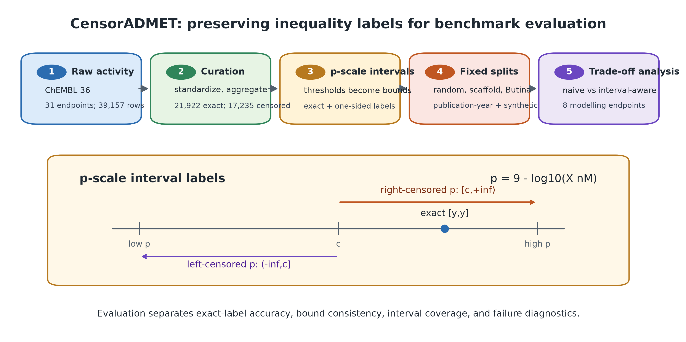
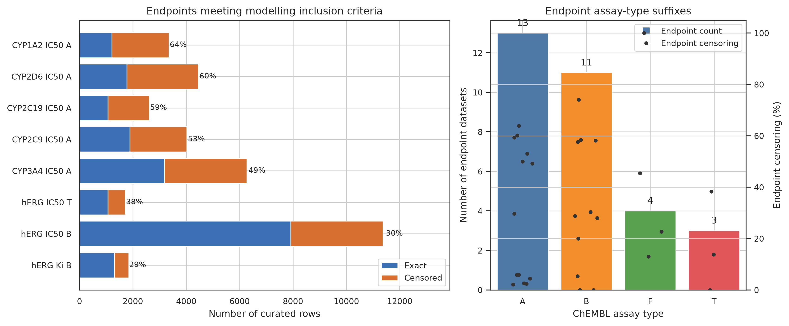
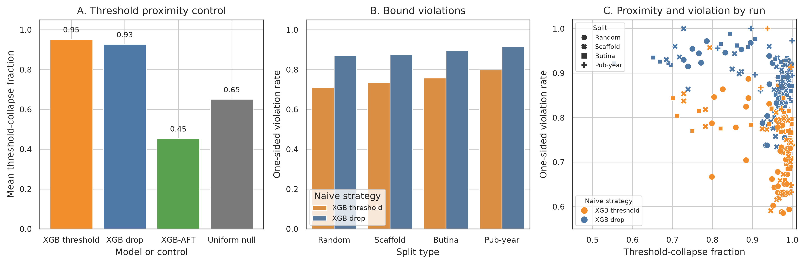
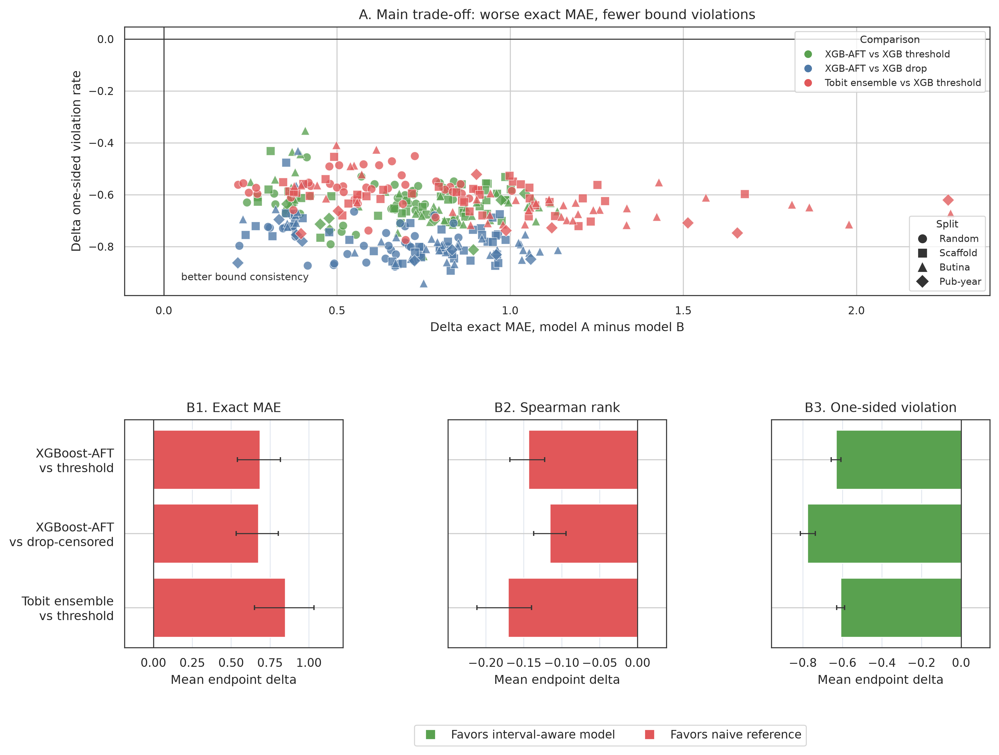
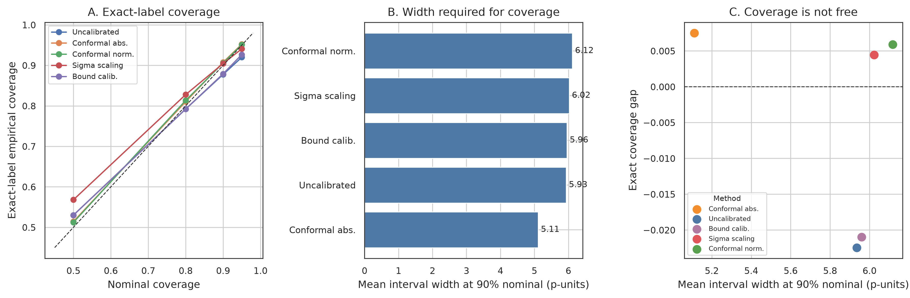
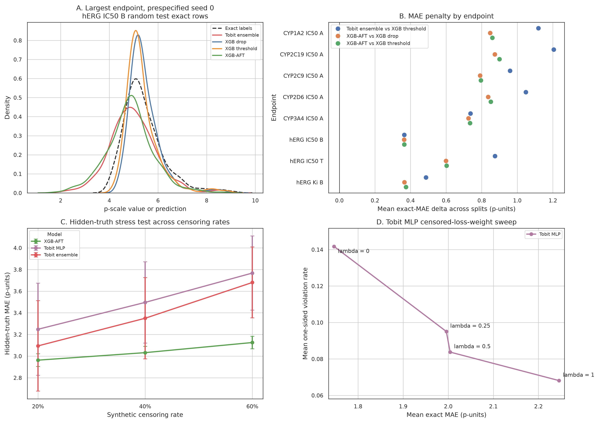

# CensorADMET: Results Showcase

CensorADMET is a public benchmark for ADMET regression when assay results are
reported as inequalities such as `>10 micromolar` or `<1 micromolar`, rather
than exact measurements. The project preserves those bounds and evaluates what
is gained and lost when models are required to respect them.

## At a glance

- 31 curated endpoint datasets
- 39,157 parent-compound records
- 21,922 exact labels and 17,235 censored labels
- 8 endpoints meeting the prespecified modelling criteria
- Random, scaffold, Butina-cluster, and publication-year shift evaluations
- Morgan fingerprints, gradient-boosted baselines, Tobit ensembles, and
  accelerated-failure-time regression
- Empirical calibration and synthetic hidden-truth stress tests at 20%, 40%,
  and 60% censoring

## Main finding

Interval-aware models substantially reduce violations of known assay bounds, but
that consistency comes with a measurable exact-label cost. Across the main
endpoint-level comparisons:

- one-sided bound violations improve by **0.61--0.78**;
- exact-label MAE worsens by **0.68--0.85 p-units**;
- Spearman correlation decreases by **0.12--0.17**.

The result is a useful modelling trade-off rather than a universal leaderboard
win. It shows why censored ADMET benchmarks need to report both predictive
accuracy and constraint consistency.

## Selected figures

## Data files

- [Benchmark overview](data/benchmark_overview.csv)
- [Model trade-offs](data/model_tradeoffs.csv)
- [Endpoint-level inference](data/endpoint_level_inference.csv)
- [Calibration results](data/calibration_results.csv)
- [Naive-failure controls](data/naive_failure_controls.csv)
- [Chemical-shift results](data/chemical_shift_results.csv)

The showcase contains aggregate results and publication figures only. Raw
ChEMBL records, model checkpoints, internal analysis directories, and manuscript
sources are intentionally kept outside this recruiter-facing view.
